## Recap: Neural Networks (or MLP)

<div style="text-align:center;">
  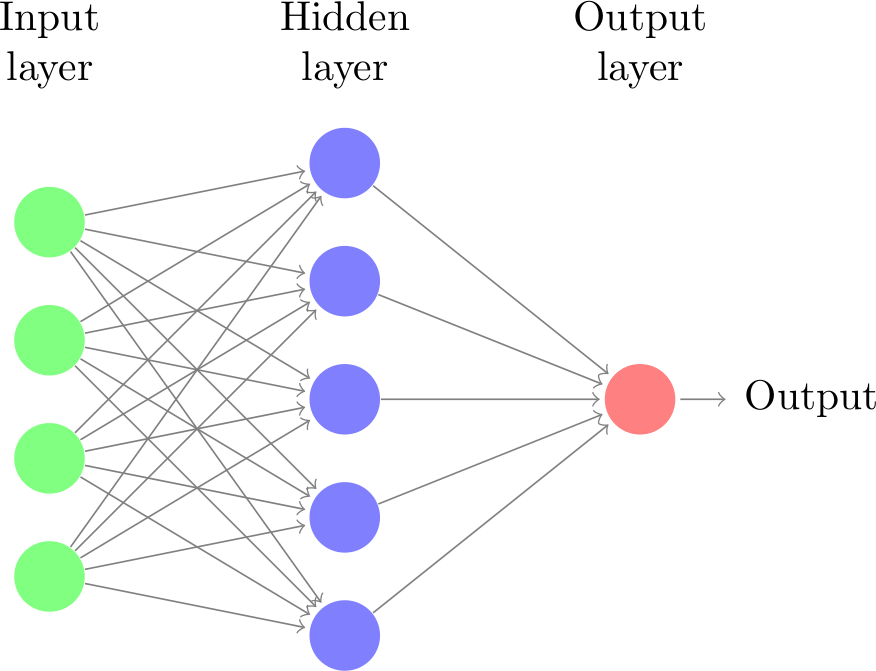
</div>

## Recap: Convolutional Neural Networks (CNN)

- Local filter
- Translation invariance

<div style="text-align:center;">
  
</div>

<div style="text-align:center;">
  
</div>

[source: Arden Dertat](https://towardsdatascience.com/applied-deep-learning-part-4-convolutional-neural-networks-584bc134c1e2)

# Graph Neural Networks

## Principles

- A deep learning framework for graph-structured data
- It generalises traditional neural networks to handle graph data by leveraging the relationships between nodes in a graph
- Message passing: nodes aggregate neighbor features over the graph
- Variants differ in how neighbors are aggregated and weighted

## Major GNN Architectures

- **GCN**: shared filters; normalised neighborhood aggregation (spectral → spatial)
- **GraphSAGE**: inductive sampling + learnable aggregators (mean/pool/LSTM)
- **GAT**: attention over neighbors; learns edge weights; multi-head for capacity
- *Not today's focus, but worth mentioning*
- **DeepWalk**: unsupervised node embeddings via random walks (word2vec-like)
- **ChebNet**: spectral filtering via Chebyshev polynomials; localised convolutions

## Graph Convolutional Networks (GCN)

<div style="text-align:center;">
  
</div>

## Introduction: Graphs

:::: columns

::: {.column width="50%"}

- Graph = organised data representation
- Consists of vertices (nodes) V and edges E
- Edges can be weighted or binary
- Edges can be directed or undirected

Example graph:

$$V = \{A, B, C, D, E, F, G\}$$
$$E = \{(A,B), (B,C), (C,E), ...\}$$

:::

::: {.column width="50%"}
<div style="text-align:center;">
  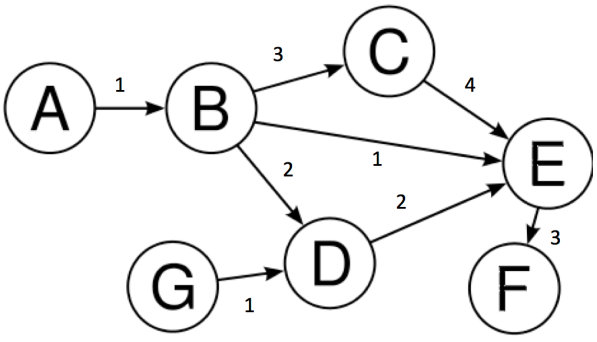
</div>
:::
::::

## Graph Terminology

<div style="text-align:center;">
  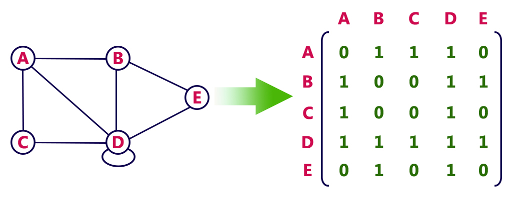
</div>

- **Node**: An entity in the graph (represented by circles)
- **Edge**: Line joining two nodes (represents relationships)
- **Degree**: Number of edges incident with a vertex
- **Adjacency Matrix**: N×N matrix representing graph structure

## Why GCNs?

<div style="text-align:center;">
  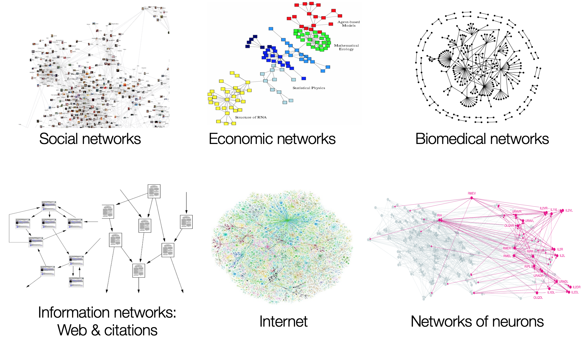
</div>

## Why GCNs?

- Most real-world datasets come as graphs or networks:
  - Social networks
  - Protein-interaction networks
  - The World Wide Web
- Learning on graphs enables domain-specific insights
- Conventional CNNs assume compositional structure on Euclidean space
  - 2D grids (images)
  - 1D sequences (text, audio)

## CNNs vs GCNs

:::: columns

::: {.column width="50%"}

**CNN Key Properties:**

- Locality
- Stationarity (Translation Invariance)
- Multi-scale hierarchies

**Problem:** Not all data lies on Euclidean space!

:::

::: {.column width="50%"}
<div style="text-align:center;">
  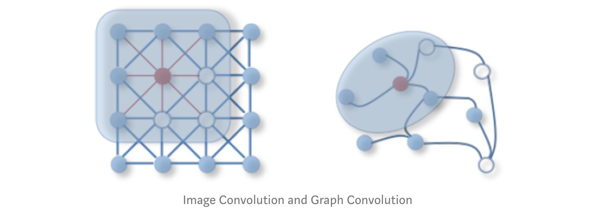
</div>
:::
::::

## Applications of GCNs

:::: columns

::: {.column width="50%"}
<div style="text-align:center;">
  
  <div style="font-size:0.8em; color: #555; margin-top:4px;">
    Facebook Link Prediction for Suggesting Friends using Social Networks
  </div>
</div>
:::

::: {.column width="50%"}
- Friend prediction algorithms
- Social network analysis
- Protein interaction prediction
- Knowledge graph completion
:::

::::

## What are GCNs?

- Neural networks operating on graphs
- Capture neighbourhood information for non-euclidean spaces
- Re-define convolution for graph domains

**Two Styles:**

- Spectral GCNs: Graph signal processing perspective; Flourier transform on graphs; frequency domain
- **Spatial GCNs**: Aggregate feature information from neighbours; more flexible (OUR FOCUS!)

## How GCNs Work? Friend Prediction

:::: columns

::: {.column width="50%"}

**Task:** Predict future friendships

- Edges = friendships
- More common friends → higher likelihood
- $(1,3)$ have 2 common friends
- $(1,5)$ have 0 common friends
- So, $(1,3)$ is more likely to become friends than $(1,5)$
:::

::: {.column width="50%"}
<div style="text-align:center;">
  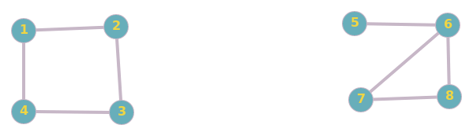
</div>
:::
::::

## Try it again - Friend Prediction

:::: columns

::: {.column width="50%"}

**Problem:** Predict future friendships

- $(1,11)$ have 1 common friends and distance of 2
- $(3,11)$ have 0 common friends and distance of 4
- So, $(1,11)$ is more likely to become friends than $(3,11)$
:::

::: {.column width="50%"}
<div style="text-align:center;">
  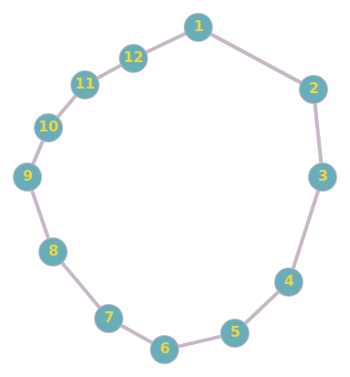
</div>
:::
::::

## How to implement this idea MATHMATICALLY?

- Using *filtering*, from CNN?
- In CNN, we apply a *filter* on an image to get representation of next layer
- In a graph, we apply a *filter* to create the next layer representation, by aggregating the features of neighbours
- **Note**: in each layer, the graph structure is fixed, but the features of each node are updated.

<div style="text-align:center;">
  
</div>

## Adjacency matrix & feature matrix

<div style="text-align:center;">
  
</div>

:::: columns

::: {.column width="50%"}
Adjacency matrix
$$
A = \begin{pmatrix}
0 & 1 & 0 & 1 & 0 & 0 & 0 & 0 \\
1 & 0 & 1 & 0 & 0 & 0 & 0 & 0 \\
0 & 1 & 0 & 1 & 0 & 0 & 0 & 0 \\
1 & 0 & 1 & 0 & 0 & 0 & 0 & 0 \\
0 & 0 & 0 & 0 & 0 & 1 & 0 & 0 \\
0 & 0 & 0 & 0 & 1 & 0 & 1 & 1 \\
0 & 0 & 0 & 0 & 0 & 1 & 0 & 1 \\
0 & 0 & 0 & 0 & 0 & 1 & 1 & 0
\end{pmatrix}
$$
:::

::: {.column width="50%"}
Feature matrix (Randomly initialised. Can be age, hobby, etc)
$$
H^0 = \left( \begin{array}{ccc}
1 & 0 & 1 \\ 
1 & 1 & 0 \\
0 & 1 & 1 \\
1 & 1 & 1 \\
0 & 0 & 1 \\
0 & 1 & 0 \\
1 & 0 & 0 \\
1 & 1 & 0
\end{array} \right)
$$
:::

::::

## Update rule for a node in a new layer

- Iteratively, calculate new features for each node in a new layer by aggregating from neighhours in the previous layer
- Each layer represent 'friends' information at different 'hops'
$$
h_v^i = \sum_{u \in \mathcal{N}(v)} h_u^{i-1}
$$

where $\mathcal{N}(v)$ is the set of immediate neighbours of $v$, excluding $v$ itself.

## Layer 1: $H^1 = A H^0$

<div style="text-align:center;">
  
</div>

- Node 1 (Neighbours: 2, 4):$h_1^1 = h_2^0 + h_4^0 = [1, 1, 0] + [1, 1, 1] = \mathbf{[2, 2, 1]}$
- Node 3 (Neighbours: 2, 4):$h_3^1 = h_2^0 + h_4^0 = [1, 1, 0] + [1, 1, 1] = \mathbf{[2, 2, 1]}$
- Node 5 (Neighbour: 6):$h_5^1 = h_6^0 = \mathbf{[0, 1, 0]}$
- *Note*: Node 1 and 3 have **identifical** features after one layer, due to same set of neighbours.
- $(1,3)$ is more similar than $(1,5)$

## Layer 2: $H^2 = A H^1$. Friend-of-friend

<div style="text-align:center;">
  
</div>

- Node 1 (Neighbours: 2, 4):$h_1^2 = h_2^1 + h_4^1 = [1, 1, 2] + [1, 1, 2] = \mathbf{[2, 2, 4]}$
- Node 3 (Neighbours: 2, 4):$h_3^2 = h_2^1 + h_4^1$$h_3^2 = [1, 1, 2] + [1, 1, 2] = \mathbf{[2, 2, 4]}$
- Node 5 (Neighbour: 6):$h_5^2 = h_6^1$$h_6^1 = h_5^0 + h_7^0 + h_8^0 = [2, 1, 1] = \mathbf{[2, 1, 1]}$
- $(1,3)$ is more similar than $(1,5)$

## Convolution on a graph

Layer-wise propagation:

$$H^{i} = f(H^{i-1}, A)$$

$$f(H^{i}, A) = AH^{i}$$

where:

- $A$ = N × N adjacency matrix
- $H^{0} = X$ (initial features)
- $X$ = input feature matrix (N × F, F = number of features)
- But: this formula is deterministic and linear, containing no learnable parameters 
- To improve it, we introduce a non-linear ReLU activation function and a learnable *weight* matrix

## GCN Mathematical Formulation

Layer-wise propagation:

$$H^{i} = f(H^{i-1}, A)$$

$$f(H^{i}, A) = σ(AH^{i}W^{i})$$

where:

- $A$ = N × N adjacency matrix
- $W^{(l)}$ = learnable weight matrix for layer $l$. Shape $F^{in}$ x $F^{out}$.   
- $H^{0} = X$ (initial features), shape N × F 
- $X$ = input feature matrix (N × F, F = number of features)
- $σ$ = ReLU activation function
- Each layer aggregates neighborhood features from previous layer 

## Problem 1: No self-representation

- New features don't include node's own features
- Node 1 and 3 become identical after one layer, despite different initial features
- Node 1 (Neighbours: 2, 4):$h_1^1 = h_2^0 + h_4^0 = [1, 1, 0] + [1, 1, 1] = \mathbf{[2, 2, 1]}$
- Node 3 (Neighbours: 2, 4):$h_3^1 = h_2^0 + h_4^0 = [1, 1, 0] + [1, 1, 1] = \mathbf{[2, 2, 1]}$
<div style="text-align:center;">
  
</div>

- **Solution: Add self-loops**
- Add identity: $\hat{A} = A + I$
- Node 1: $h_1^1 = h_1^0 + h_2^0 + h_4^0 = [1,0,1] + [1,1,0] + [1,1,1] = \mathbf{[3, 2, 2]}$
- Node 3: $h_3^1 = h_2^0 + h_3^0 + h_4^0 = [1,1,0] + [0,1,1] + [1,1,1] = \mathbf{[2, 3, 2]}$
- Now, they are different due to self-loops

## Problem 2: Degree scaling 

- High-degree nodes get larger values; low-degree nodes get smaller values
- Node 5 (Self + 6):$h_5^1 = h_5^0 + h_6^0 = [0, 0, 1] + [0, 1, 0] = \mathbf{[0, 1, 1]}$
- Node 6 (Self + 5, 7, 8):$h_6^1 = h_6^0 + h_5^0 + h_7^0 + h_8^0 = [0, 1, 0] + [0, 0, 1] + [1, 0, 0] + [1, 1, 0] = \mathbf{[2, 2, 1]}$
<div style="text-align:center;">
  
</div>

## Problem 2: Degree scaling 

- **Solution: Normalise by degree**
- Symmetric normalisation: $\hat{D}^{-\frac{1}{2}}\hat{A}\hat{D}^{-\frac{1}{2}}$, where $\hat{D}$ is degree matrix of $\hat{A}$
- $\tilde{d}_5 = 2, \tilde{d}_6 = 4, \tilde{d}_7 = 3, \tilde{d}_8 = 3$
- $h_5^1 = \left( \frac{1}{\sqrt{\tilde{d}_5 \cdot \tilde{d}_5}} \right) h_5^0 + \left( \frac{1}{\sqrt{\tilde{d}_5 \cdot \tilde{d}_6}} \right) h_6^0 = \frac{1}{2}[0, 0, 1] + \frac{1}{\sqrt{8}}[0, 1, 0] \approx \mathbf{[0, 0.35, 0.5]}$
- $h_6^1 = 0.25[0, 1, 0] + 0.35[0, 0, 1] + 0.28[1, 0, 0] + 0.28[1, 1, 0] \approx \mathbf{[0.56, 0.53, 0.35]}$

## Final GCN Propagation Rule

$$f(H^{(l)}, A) = \sigma\left( \hat{D}^{-\frac{1}{2}}\hat{A}\hat{D}^{-\frac{1}{2}}H^{(l)}W^{(l)}\right)$$

where:

- $\hat{A} = A + I$ (adjacency + self-loops)
- $I$ = identity matrix
- $\hat{D}$ = diagonal degree matrix of $\hat{A}$
- $W^{(l)}$ = learnable weight matrix for layer $l$
- $\sigma$ = activation function

# Implementing GCN in PyTorch

## GCN Convolutional Layer

```python
class GCNConv(nn.Module):
    def __init__(self, A, in_channels, out_channels):
        super(GCNConv, self).__init__()
        self.A_hat = A + torch.eye(A.size(0))
        self.D     = torch.diag(torch.sum(A,1))
        self.D     = self.D.inverse().sqrt()
        self.A_hat = torch.mm(torch.mm(self.D, self.A_hat), self.D)
        self.W     = nn.Parameter(torch.rand(in_channels,out_channels))
    
    def forward(self, X):
        out = torch.relu(torch.mm(torch.mm(self.A_hat, X), self.W))
        return out
```

## GCN Network Architecture

```python
class Net(torch.nn.Module):
    def __init__(self, A, nfeat, nhid, nout):
        super(Net, self).__init__()
        self.conv1 = GCNConv(A, nfeat, nhid)
        self.conv2 = GCNConv(A, nhid, nout)
        
    def forward(self, X):
        H  = self.conv1(X)
        H2 = self.conv2(H)
        return H2
```
<div style="text-align:center;">
  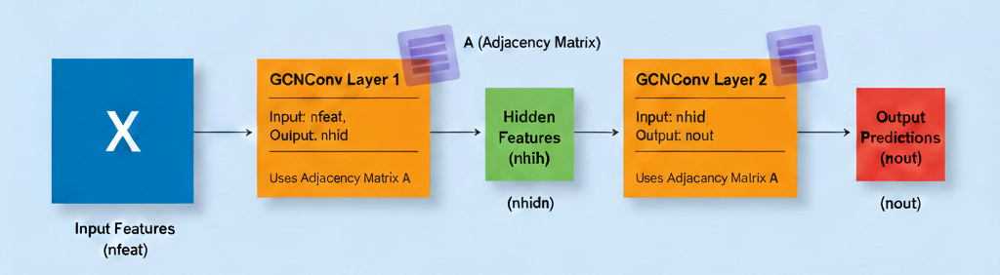
</div>

## Case Study: Zachary's Karate Club

**Context (1970-1972):**

- Observed local karate club
- Conflict between administrator "John A" and instructor "Mr. Hi" led to club split into two groups
- Based on this graph, **aim to predict which members join which group**

<div style="text-align:center;">
  
</div>

## Semi-Supervised Learning Setup

- **Labels known** for only 2 nodes: John A (0) and Mr. Hi (1)
- **Predict labels** for all other members based on graph structure
- Use graph connectivity to propagate information

```python
# Only nodes 0 and 33 are labeled
target = torch.tensor([0,-1,-1,-1,...,-1,-1,1])

# Feature matrix (one-hot encoding)
X = torch.eye(A.size(0))

# 'A' is the adjacency matrix of the karate club graph. It contains 1 at position (i,j) if there is an edge between node i and j, and 0 otherwise.

```

## Training the Model

```python

X=torch.eye(A.size(0))  # Identity matrix as initial X features

# Here we are creating a network with 10 features in hidden layer and 2 in output layer (John A's group vs Mr. Hi's group)

# Initialise network
model = Net(A, X.size(0), 10, 2)

# Loss and optimizer
criterion = torch.nn.CrossEntropyLoss(ignore_index=-1)
optimizer = optim.SGD(model.parameters(), lr=0.01, momentum=0.9)

# Training loop
for epoch in range(200):
    optimizer.zero_grad()
    loss = criterion(model(X), target)
    loss.backward()
    optimizer.step()
```

## Training the model

- What parameters are trained? Weight matrix W and a bias vector for each layer (*intercept*)
  - Layer 1 (conv1): A matrix of size (nfeat, nhid)
  - Layer 2 (conv2): A matrix of size (nhid, nout)

$$f(H^{(l)}, A) = \sigma\left( \hat{D}^{-\frac{1}{2}}\hat{A}\hat{D}^{-\frac{1}{2}}H^{(l)}W^{(l)}\right)$$

<div style="text-align:center;">
  
</div>


## Training Visualisation

<div style="text-align:center;">
  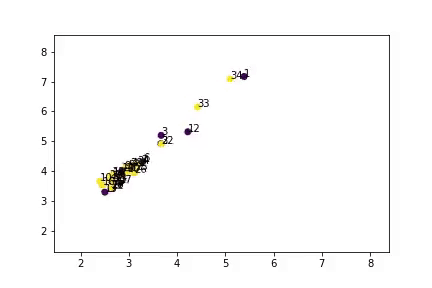
  <div style="font-size:0.8em; color: #555; margin-top:4px;">
    Node embeddings learned during training
  </div>
</div>

- Model successfully separates two groups
- Close to actual predictions (except node 9)
- Semi-supervised learning works!

## PyTorch Geometric

:::: columns

::: {.column width="40%"}

**PyTorch Geometric (PyG):**

- Dedicated library for graph deep learning
- Easy, fast, and simple implementation
- Active development and community

**Features:**

- Pre-built GCN layers
- Various graph datasets
- Efficient sparse operations

:::

::: {.column width="60%"}

```python
from torch_geometric.nn import GCNConv

class GCN(torch.nn.Module):
    def __init__(self):
        super().__init__()
        self.conv1 = GCNConv(num_features, 16)
        self.conv2 = GCNConv(16, num_classes)
        
    def forward(self, x, edge_index):
        x = self.conv1(x, edge_index)
        x = F.relu(x)
        x = self.conv2(x, edge_index)
        return F.log_softmax(x, dim=1)
```

:::
::::


# GraphSAGE

## Why GraphSAGE (Sample and Aggregate)?

- GCNs are **transductive**: requires full graph structure; can't generalise to unseen nodes/graphs
- GraphSAGE is **inductive**: learns aggregation functions that can be applied to unseen nodes/graphs

<div style="text-align:center;">
  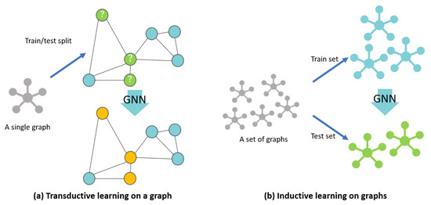
  <div style="font-size:0.8em; color: #555; margin-top:4px;">
    Transductive vs inductive learning on graph. Source: https://www.mdpi.com/2220-9964/10/2/97
  </div>
</div>

## Why GraphSAGE (Sample and Aggregate)?

- GraphSAGE is more **scalable**: neighborhood sampling to generate **mini-batches**, rather than processing the entire graph at once
- GraphSAGE allows for **learnable aggregators**: mean, pooling (MLP + max), LSTM; where GCN uses fixed mean aggregation
- GraphSAGE **learns weights per layer**; where GCN uses fixed weights from adjacency matrix
- GraphSAGE treats self-representation and neighbours differently: **concatenating**.

## GraphSAGE Aggregators

:::: columns

::: {.column width="50%"}
- Mean aggregator: elementwise mean over neighbors
- Pool aggregator: transform neighbor features using a MLP, then max-pool
- LSTM aggregator: sequence model over randomly ordered neighbors

:::

::: {.column width="50%"}
<div style="text-align:center;">
  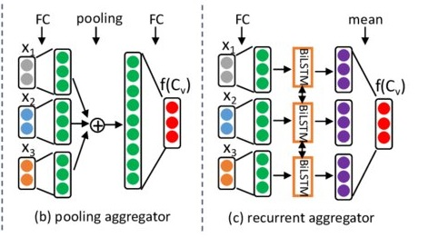
</div>
:::
::::

## Example of GraphSAGE update rules

<div style="text-align:center;">
  
</div>

- Step 1: Initial Features ($H^0$)
- Node 6: $h_6^0 = [0, 1]$
- Neighbours (5, 7, 8): $h_5^0 = [0, 0]$, $h_7^0 = [1, 0]$, $h_8^0 = [1, 1]$

## Step 2: Aggregate the Neighbours

<div style="text-align:center;">
  
</div>

$$\text{AGG}_{\text{neigh}} = \text{mean}([0, 0], [1, 0], [1, 1]) = [0.66, 0.33]$$

## Step 3: Concatenation

<div style="text-align:center;">
  
</div>

- Join the self-vector and the neighbour-vector (increase dimension from 2 to 4)
$$\text{CONCAT}(h_6^0, \text{AGG}_{neigh}) = [ \underbrace{0, 1}_{\text{Self}}, \underbrace{0.66, 0.33}_{\text{Neighbours}} ]$$

## Step 4: Linear Transformation ($W^k$)

- Bring the dimension back, from 4 to 2
- Suppose $W^1$ is a $2 \times 4$ matrix
$$h_6^1 = \sigma \left( \begin{pmatrix} w_{11} & w_{12} & w_{13} & w_{14} \\ w_{21} & w_{22} & w_{23} & w_{24} \end{pmatrix} \cdot \begin{bmatrix} 0 \\ 1 \\ 0.66 \\ 0.33 \end{bmatrix} \right)$$

## Why concatenation works?

- **Identity Preservation**: in GCN, if Node 6 has 100 neighbours, its own features only contribute $1\%$ to the next layer. In GraphSAGE, the self-features always occupy a **dedicated** portion of the input to the next layer (as the first half of the concat vector).
- **Flexible Weighting**: weight matrix $W$ can learn to weight "self" differently than "neighbours".
  - Note: $W$ is learned per layer from training, not fixed.
  - It might learn that your own interests are more important for friend prediction than your neighbours' interests.

## When to use GCN or GraphSAGE?

- Use GCN for small, static, or fully known graphs where node information does not change rapidly.
- Use GraphSAGE for *large*, *dynamic*, or *streaming* graphs, where you need to generate embeddings for unseen or new nodes without retraining the entire model.

# Graph Attention Networks (GAT)

## Why GAT?

- **Treating neighhours differently**: GCN use fixed aggregation (mean, sum, etc.) that treats all neighbors equally. GAT learns to assign different importance to different neighbors using attention mechanisms.
- **Weight Calculation**: GCN uses fixed, structural weights (based on graph Laplacian). GAT learns these weights dynamically during training
- **Better Performance**: GAT generally outperforms GCN on node classification task. GATs are particularly effective when the graph structure is complex or sparse.
- **Higher Computational Complexity**: GAT is more resource-intensive and slower to train; GCN is faster and more situable for large-scale graphs.

## What is ATTENTION in GAT?

- Attention weight $\alpha_{i,j}$ measures the importance of neighbor $j$ to node $i$

$h_i^{(l+1)} = \sigma \left( \sum_{j \in \mathcal{N}_i} \alpha_{ij}^{(l)} \mathbf{W}^{(l)} h_j^{(l)} \right)$

<div style="text-align:center;">
  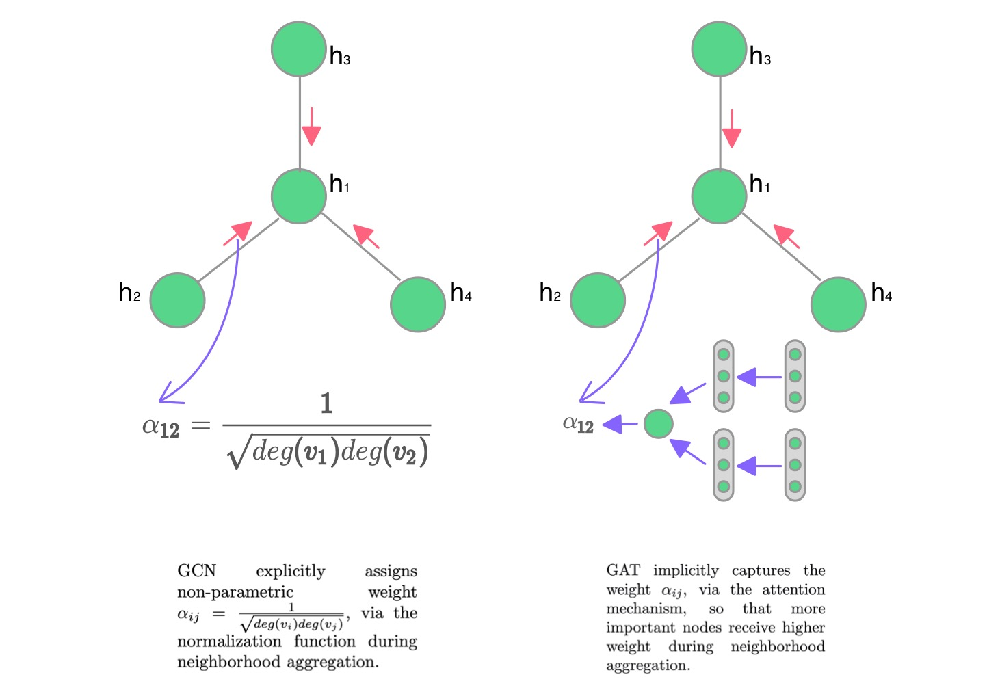
</div>

## Attention weight

<div style="text-align:center;">
  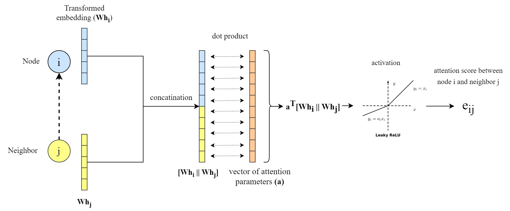
</div>

- A clear explanation: [https://epichka.com/blog/2023/gat-paper-explained/](https://epichka.com/blog/2023/gat-paper-explained/)

## Masked Attention

- Only weights for neighbors are computed, others masked

<div style="text-align:center;">
  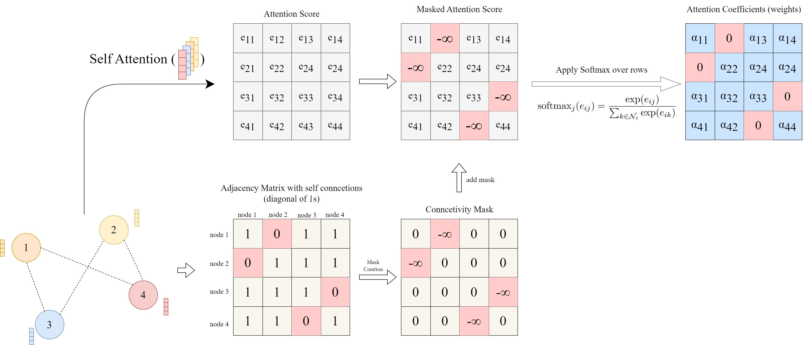
</div>

## Multi-head Attention to stabilise learning

- To mitigate randomness in calculating attention weights, e.g. random initialisation

$$h_i^{(l+1)} = \sigma \left( \frac{1}{K} \sum_{k=1}^{K} \sum_{j \in \mathcal{N}_i} \alpha_{ij}^{k} \mathbf{W}^{k} h_j^{(l)} \right)$$

<div style="text-align:center;">
  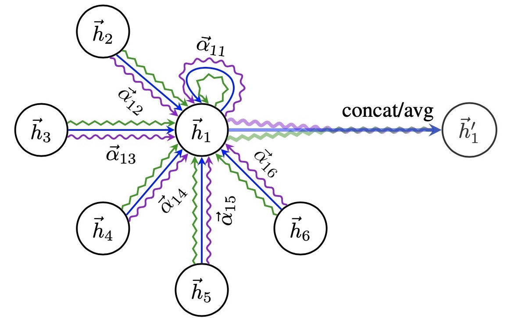
  <div style="font-size:0.8em; color: #555; margin-top:4px;">
    Concatenate intermediate heads; average at final layer
  </div>
</div>

## Attention visualisation for interpretability

- To understand which neighbors are most influential for a node

<div style="text-align:center;">
  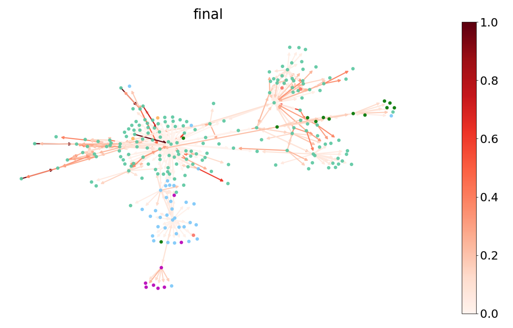
  <div style="font-size:0.8em; color: #555; margin-top:4px;">
    https://www.dgl.ai/blog/2019/02/17/gat.html
  </div>
</div>


## Key Takeaways

- GCNs extend neural networks to non-Euclidean graph data
- Aggregate and transform neighbourhood information
- Address self-representation and degree scaling issues
- Semi-supervised learning on graphs is powerful
- Applications: social networks, molecules, knowledge graphs

**Q:** How powerful are GCNs really?

Read: [How powerful are Graph Convolutions?](https://www.inference.vc/how-powerful-are-graph-convolutions-review-of-kipf-welling-2016-2/)

## Resources

- [graphnet Github repo](https://github.com/dsgiitr/graph_nets)

**Key Papers:**

- [Semi-Supervised Classification with GCNs](https://arxiv.org/abs/1609.02907) - Kipf & Welling (2017)
- [Thomas Kipf's Blog on GCNs](https://tkipf.github.io/graph-convolutional-networks/)

**Libraries:**

- [PyTorch Geometric](https://github.com/rusty1s/pytorch_geometric)
- [Deep Graph Library (DGL)](https://www.dgl.ai/)

## Questions?
