<a href="https://colab.research.google.com/github/huanfachen/DSSS_25/blob/main/sessions/W06_graph_neural_networks/graph_neural_networks_practical.ipynb" target="_parent"></a>

# Introduction

In this practical, we will use [PyTorch](https://www.pytorch.org/) to:

1. Build a Graph Convolutional Network (GCN) for node classification on the Cora dataset;
2. Build a GraphSAGE model for node classification on the Cora dataset.

## Setting up Google Colab

As installing and configuring tensorflow on laptop can be a pain, we recommend using Google Colab for this practical. Click [here](https://colab.research.google.com/github/huanfachen/DSSS_25/blob/main/sessions/W06_graph_neural_networks/graph_neural_networks_practical.ipynb) to run this practical on Google Colab, which requires a Google account.

Resource limit of Google Colab under free plan:

- Memory: up to 12 GB.
- Maximum duration of running a notebook: notebooks can run for at most **12 hours**, depending on availability and your usage patterns. (The notebook will die after at most 12 hours)
- GPU duration: dynamic, up to a few hours. If you use GPU regularly, runtime durations will become shorter and shorter and disconnections more frequent.

*Very Important* - we will use the GPU on Google Colab to accelerate the model training. To do this, go to 'Runtime' -> 'Change runtime type' -> Select 'T4 GPU' -> Save. See below.


If you are following along in your own development environment, rather than Colab, see the [install guide](https://www.pytorch.org/get-started/locally/) for setting up PyTorch for development. You would need to install two packages of ```torch``` and ```torch_geometric```.

## Cora Dataset

We will be using the 'Cora' Dataset ([link](https://ieee-dataport.org/documents/cora)). The Cora dataset consists of 2708 Machine Learning papers, and the citation network consists of 5429 links. Each publication in the dataset is described by a 0/1-valued word vector indicating the absence/presence of the corresponding word from the dictionary. The dictionary consists of 1433 unique words.

These papers are classified into one of the following seven classes:

- Case_Based
- Genetic_Algorithms
- Neural_Networks
- Probabilistic_Methods
- Reinforcement_Learning
- Rule_Learning
- Theory

The papers were selected in a way such that in the final corpus every paper cites or is cited by at least one other paper.

# GCN for Karate Club Dataset

First, we will re-visit the Karate Club dataset and implement GCN for it using PyTorch Geometric. This example is based on the '[Semi Supervised Graph Learning Model](https://arxiv.org/abs/1609.02907)' proposed in the paper by <b>Thomas Kipf & Max Welling</b>.

During the period from 1970-1972, Wayne W. Zachary observed the people belonging to a local karate club. He represented these people as nodes in a graph and added an edge between a pair of people if they interacted with each other. This graph is shown below.

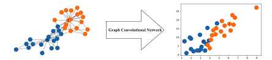

During the study, an interesting event happened. A conflict arose between the administrator "John A" and instructor "Mr. Hi", which led to the split of the club into two. Half of the members formed a new club around Mr. Hi; members from the other part found a new instructor or gave up karate. 

Using the graph that he had found earlier, he tried to predict which member will go to which half. And surprisingly he was able to predict the decision of all the members except for node 9 who went with Mr. Hi instead of John A. Zachary used the maximum flow – minimum cut Ford–Fulkerson algorithm for this. We will be using a different algorithm today; hence, ignore the Ford-Fulkerson algorithm!

Here, we will be using the Semi-Supervised Graph Learning Method. Semi-Supervised means that we have labels for only some of the nodes, and we have to find the labels for other nodes. We have the labels for only the nodes belonging to 'John A' and 'Mr. Hi', we have not been provided with labels for any other member, and we have to predict that only on the basis of the graph given to us.

In this example, we have the label for admin (node 1) and instructor (node 34), so only these two contain the class label (0 and 1) all other are set to -1, which means that the predicted value of these nodes will be ignored in the computation of loss function.

To use the GCN, we need to know the feature matrix. As we don't have any feature of each node, for simplicity, we will be using the one-hot encoding corresponding to the index of the node.

The complete code is as below. Please note that we commented out the part of plotting the animination using celluloid, as it requires a few addditional libaries. You can uncomment it if you want to see the animation of the training process. We will focus on the the change of the loss function and the accuracy of the model for predicting the labels of all nodes during training.

```{python}
#### Loading Required Libraries ####

import torch
import torch.nn as nn
import torch.optim as optim
import matplotlib.pyplot as plt
from sklearn.metrics import accuracy_score
# get_ipython().run_line_magic('matplotlib', 'notebook')

# import imageio
# from celluloid import Camera
# from IPython.display import HTML

# plt.rcParams['animation.ffmpeg_path'] = '/usr/local/bin/ffmpeg'


#### The Convolutional Layer ####
# First we will be creating the GCNConv class, which will serve as the Layer creation class.
# Every instance of this class will be getting Adjacency Matrix as input and will be outputing
# 'RELU(A_hat * X * W)', which the Net class will use.

class GCNConv(nn.Module):
    def __init__(self, A, in_channels, out_channels):
        super(GCNConv, self).__init__()
        self.A_hat = A+torch.eye(A.size(0))
        self.D     = torch.diag(torch.sum(self.A_hat,1))
        self.D     = self.D.inverse().sqrt()
        self.A_hat = torch.mm(torch.mm(self.D, self.A_hat), self.D)
        self.W     = nn.Parameter(torch.rand(in_channels,out_channels, requires_grad=True))
    
    def forward(self, X):
        out = torch.relu(torch.mm(torch.mm(self.A_hat, X), self.W))
        return out

class Net(torch.nn.Module):
    def __init__(self,A, nfeat, nhid, nout):
        super(Net, self).__init__()
        self.conv1 = GCNConv(A,nfeat, nhid)
        self.conv2 = GCNConv(A,nhid, nout)
        
    def forward(self,X):
        H  = self.conv1(X)
        H2 = self.conv2(H)
        return H2


# 'A' is the adjacency matrix, it contains 1 at a position (i,j), if there is a edge between the node i and node j.
A=torch.Tensor([[0,1,1,1,1,1,1,1,1,0,1,1,1,1,0,0,0,1,0,1,0,1,0,0,0,0,0,0,0,0,0,1,0,0],
                [1,0,1,1,0,0,0,1,0,0,0,0,0,1,0,0,0,1,0,1,0,1,0,0,0,0,0,0,0,0,1,0,0,0],
                [1,1,0,1,0,0,0,1,1,1,0,0,0,1,0,0,0,0,0,0,0,0,0,0,0,0,0,1,1,0,0,0,1,0],
                [1,1,1,0,0,0,0,1,0,0,0,0,1,1,0,0,0,0,0,0,0,0,0,0,0,0,0,0,0,0,0,0,0,0],
                [1,0,0,0,0,0,1,0,0,0,1,0,0,0,0,0,0,0,0,0,0,0,0,0,0,0,0,0,0,0,0,0,0,0],
                [1,0,0,0,0,0,1,0,0,0,1,0,0,0,0,0,1,0,0,0,0,0,0,0,0,0,0,0,0,0,0,0,0,0],
                [1,0,0,0,1,1,0,0,0,0,0,0,0,0,0,0,1,0,0,0,0,0,0,0,0,0,0,0,0,0,0,0,0,0],
                [1,1,1,1,0,0,0,0,0,0,0,0,0,0,0,0,0,0,0,0,0,0,0,0,0,0,0,0,0,0,0,0,0,0],
                [1,0,1,0,0,0,0,0,0,0,0,0,0,0,0,0,0,0,0,0,0,0,0,0,0,0,0,0,0,0,1,0,1,1],
                [0,0,1,0,0,0,0,0,0,0,0,0,0,0,0,0,0,0,0,0,0,0,0,0,0,0,0,0,0,0,0,0,0,1],
                [1,0,0,0,1,1,0,0,0,0,0,0,0,0,0,0,0,0,0,0,0,0,0,0,0,0,0,0,0,0,0,0,0,0],
                [1,0,0,0,0,0,0,0,0,0,0,0,0,0,0,0,0,0,0,0,0,0,0,0,0,0,0,0,0,0,0,0,0,0],
                [1,0,0,1,0,0,0,0,0,0,0,0,0,0,0,0,0,0,0,0,0,0,0,0,0,0,0,0,0,0,0,0,0,0],
                [1,1,1,1,0,0,0,0,0,0,0,0,0,0,0,0,0,0,0,0,0,0,0,0,0,0,0,0,0,0,0,0,0,1],
                [0,0,0,0,0,0,0,0,0,0,0,0,0,0,0,0,0,0,0,0,0,0,0,0,0,0,0,0,0,0,0,0,1,1],
                [0,0,0,0,0,0,0,0,0,0,0,0,0,0,0,0,0,0,0,0,0,0,0,0,0,0,0,0,0,0,0,0,1,1],
                [0,0,0,0,0,1,1,0,0,0,0,0,0,0,0,0,0,0,0,0,0,0,0,0,0,0,0,0,0,0,0,0,0,0],
                [1,1,0,0,0,0,0,0,0,0,0,0,0,0,0,0,0,0,0,0,0,0,0,0,0,0,0,0,0,0,0,0,0,0],
                [0,0,0,0,0,0,0,0,0,0,0,0,0,0,0,0,0,0,0,0,0,0,0,0,0,0,0,0,0,0,0,0,1,1],
                [1,1,0,0,0,0,0,0,0,0,0,0,0,0,0,0,0,0,0,0,0,0,0,0,0,0,0,0,0,0,0,0,0,1],
                [0,0,0,0,0,0,0,0,0,0,0,0,0,0,0,0,0,0,0,0,0,0,0,0,0,0,0,0,0,0,0,0,1,1],
                [1,1,0,0,0,0,0,0,0,0,0,0,0,0,0,0,0,0,0,0,0,0,0,0,0,0,0,0,0,0,0,0,0,0],
                [0,0,0,0,0,0,0,0,0,0,0,0,0,0,0,0,0,0,0,0,0,0,0,0,0,0,0,0,0,0,0,0,1,1],
                [0,0,0,0,0,0,0,0,0,0,0,0,0,0,0,0,0,0,0,0,0,0,0,0,0,1,0,1,0,1,0,0,1,1],
                [0,0,0,0,0,0,0,0,0,0,0,0,0,0,0,0,0,0,0,0,0,0,0,0,0,1,0,1,0,0,0,1,0,0],
                [0,0,0,0,0,0,0,0,0,0,0,0,0,0,0,0,0,0,0,0,0,0,0,1,1,0,0,0,0,0,0,1,0,0],
                [0,0,0,0,0,0,0,0,0,0,0,0,0,0,0,0,0,0,0,0,0,0,0,0,0,0,0,0,0,1,0,0,0,1],
                [0,0,1,0,0,0,0,0,0,0,0,0,0,0,0,0,0,0,0,0,0,0,0,1,1,0,0,0,0,0,0,0,0,1],
                [0,0,1,0,0,0,0,0,0,0,0,0,0,0,0,0,0,0,0,0,0,0,0,0,0,0,0,0,0,0,0,1,0,1],
                [0,0,0,0,0,0,0,0,0,0,0,0,0,0,0,0,0,0,0,0,0,0,0,1,0,0,1,0,0,0,0,0,1,1],
                [0,1,0,0,0,0,0,0,1,0,0,0,0,0,0,0,0,0,0,0,0,0,0,0,0,0,0,0,0,0,0,0,1,1],
                [1,0,0,0,0,0,0,0,0,0,0,0,0,0,0,0,0,0,0,0,0,0,0,0,1,1,0,0,1,0,0,0,1,1],
                [0,0,1,0,0,0,0,0,1,0,0,0,0,0,1,1,0,0,1,0,1,0,1,1,0,0,0,0,0,1,1,1,0,1],
                [0,0,0,0,0,0,0,0,1,1,0,0,0,1,1,1,0,0,1,1,1,0,1,1,0,0,1,1,1,1,1,1,1,0]
                ])

# actual label
label = [0, 0, 0, 0 ,0 ,0 ,0, 0, 1, 1, 0 ,0, 0, 0, 1 ,1 ,0 ,0 ,1, 0, 1, 0 ,1 ,1, 1, 1, 1 ,1 ,1, 1, 1, 1, 1, 1 ]

# label for admin(node 1) and instructor(node 34) so only these two contain the known class label (0 and 1)
# all others are set to -1, meaning predicted value of these nodes is ignored in the loss function.
target=torch.tensor([0,-1,-1,-1, -1, -1, -1, -1,-1,-1,-1,-1, -1, -1, -1, -1,-1,-1,-1,-1, -1, -1, -1, -1,-1,-1,-1,-1, -1, -1, -1, -1,-1,1])

# X is the feature matrix.
# Using the one-hot encoding corresponding to the index of the node.
X=torch.eye(A.size(0))

# Network with 10 features in the hidden layer and 2 in output layer.
T=Net(A, X.size(0), 10, 2)


#### Training ####

criterion = torch.nn.CrossEntropyLoss(ignore_index=-1)
optimizer = optim.SGD(T.parameters(), lr=0.01, momentum=0.9)

loss=criterion(T(X),target)

#### Plot animation using celluloid ####
# fig = plt.figure()
# camera = Camera(fig)

# We will train for 200 steps and print the cross entropy loss at every 20 steps. The smaller loss means better performance of the model.
# Note that the model is trained to minimise the cross entropy loss.


for i in range(200):
    optimizer.zero_grad()
    loss=criterion(T(X), target)
    loss.backward()
    optimizer.step()
    l=(T(X));

    # plt.scatter(l.detach().numpy()[:,0],l.detach().numpy()[:,1],c=[0, 0, 0, 0 ,0 ,0 ,0, 0, 1, 1, 0 ,0, 0, 0, 1 ,1 ,0 ,0 ,1, 0, 1, 0 ,1 ,1, 1, 1, 1 ,1 ,1, 1, 1, 1, 1, 1 ])
    # for i in range(l.shape[0]):
    #     text_plot = plt.text(l[i,0], l[i,1], str(i+1))

    # camera.snap()

    if i%20==0:
        print("Cross Entropy Loss: =", loss.item())
        # print the predictive accuracy by comparing the predicted label with the actual label for all the nodes.
        pred_label = torch.argmax(l, dim=1)
        accuracy = accuracy_score(label, pred_label.detach().cpu().numpy())
        print("Accuracy: ", accuracy)

# animation = camera.animate(blit=False, interval=150)
# animation.save('./train_karate_animation.mp4', writer='ffmpeg', fps=60)
# HTML(animation.to_html5_video())

```

The results show that the loss is decreasing and the model is getting better at predicting the labels of the nodes.

# GCN for Cora data 

In this part, we will implement GCN for the Cora dataset, which is much larger and complicated than the Karate Club dataset. 

Most of the working is same as for the PyTorch version, except that we will be using an adjacency list representation instead of adjacency matrix. Using adjacency list is better than a sparse adjacency matrix, as all the edges can be stored in $O(|E|)$ where $|E|$ is the number of edges, whereas in adjacency matrix it is $O(|V|^2)$ where $|V|$ is number of vertices. So if the number of edges is much less than the number of vertices squared then adjacency list can save a lot of memory and time.

If we switch from adjacency matrix to adjacency list then the formulas involving the Adjacency Matrix will also have to be changed. Luckily, it turns out that the formulas can be changed pretty easily.

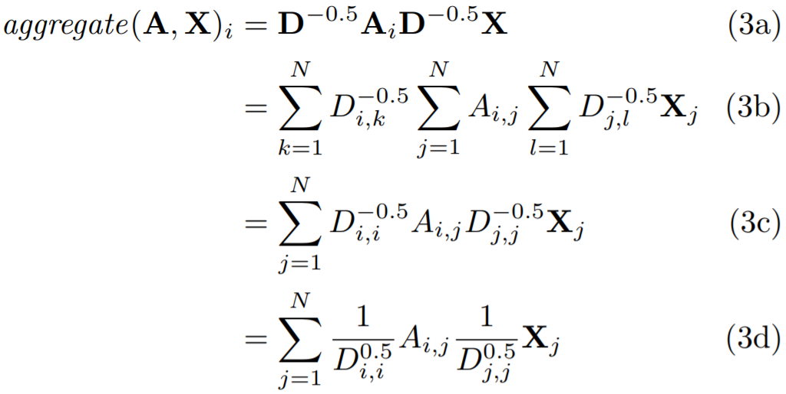

**Here $\text{aggregate}(A,X)(i)$ gives the $i$'th row of the target**

## Imports

```{python}
from torch_geometric.datasets import Planetoid
```

### Loading the Dataset

```{python}
dataset = Planetoid(root='/tmp/Cora', name='Cora')
```

### The Graph Convolution Layer

The graph convolution class handles the task of taking the adjacency list and feature matrix and outputting the required input for next layer, which can be another graph convolutional layer or maybe some other class.

```{python}
import torch
import torch.nn.functional as F
from torch_geometric.nn import MessagePassing
from torch_geometric.utils import add_self_loops, degree

class GraphConvolution(MessagePassing):
    def __init__(self, in_channels, out_channels,bias=True, **kwargs):
        super(GraphConvolution, self).__init__(aggr='add', **kwargs)
        self.lin = torch.nn.Linear(in_channels, out_channels,bias=bias)

    def forward(self, x, edge_index):
        edge_index, _ = add_self_loops(edge_index, num_nodes=x.size(0))
        x = self.lin(x)
        return self.propagate(edge_index, size=(x.size(0), x.size(0)), x=x)

    def message(self, x_j, edge_index, size):
        row, col = edge_index
        deg = degree(row, size[0], dtype=x_j.dtype)
        deg_inv_sqrt = deg.pow(-0.5)
        norm = deg_inv_sqrt[row] * deg_inv_sqrt[col]
        return norm.view(-1, 1) * x_j

    def update(self, aggr_out):
        return aggr_out
```

The 'Net' class is the one where all the layers are combined together.

```{python}
class Net(torch.nn.Module):
    def __init__(self,nfeat, nhid, nclass, dropout):
        super(Net, self).__init__()
        self.conv1 = GraphConvolution(nfeat, nhid)
        self.conv2 = GraphConvolution(nhid, nclass)
        self.dropout=dropout

    def forward(self, data):
        x, edge_index = data.x, data.edge_index

        x = self.conv1(x, edge_index)
        x = F.relu(x)
        x = F.dropout(x, self.dropout, training=self.training)
        x = self.conv2(x, edge_index)

        return F.log_softmax(x, dim=1)
```

```{python}
nfeat=dataset.num_node_features
nhid=16
nclass=dataset.num_classes
dropout=0.5
```

## Training

```{python}
device = torch.device('cuda' if torch.cuda.is_available() else 'cpu')
model = Net(nfeat, nhid, nclass, dropout).to(device)
data = dataset[0].to(device)
optimizer = torch.optim.Adam(model.parameters(), lr=0.01, weight_decay=5e-4)

model.train()
for epoch in range(200):
    optimizer.zero_grad()
    out = model(data)
    loss = F.nll_loss(out[data.train_mask], data.y[data.train_mask])
    loss.backward()
    optimizer.step()
```

```{python}
model.eval()
_, pred = model(data).max(dim=1)

# accuracy on training set
correct_train = float (pred[data.train_mask].eq(data.y[data.train_mask]).sum().item())
acc_train = correct_train / data.train_mask.sum().item()
print('Accuracy on training set: {:.4f}'.format(acc_train))

# accuracy on test set
correct = float (pred[data.test_mask].eq(data.y[data.test_mask]).sum().item())
acc = correct / data.test_mask.sum().item()
print('Accuracy on test set: {:.4f}'.format(acc))


```

Here, the testing accuracy is 0.787, which means that the model can accurately predict the labels of the nodes in the test set with 78.7% accuracy.

# GraphSAGE (SAmple and aggreGatE): Inductive Learning on Graphs

## Introduction

GCN is a method for generating node embeddings in graphs, and the basic idea behind node embedding approaches is to use dimensionality reduction techniques to distill the high-dimensional information about a node's neighborhood into a dense vector embedding. These node embeddings can then be fed to downstream machine learning systems and aid in tasks such as node classification, clustering, and link prediction. Let us move on to a slightly different problem. Now, we need the embeddings for each node of a graph where new nodes are continuously being added. A possible way to do this would be to rerun the entire model (GCN or DeepWalk) on the new graph, but it is computationally expensive. GraphSAGE provides a new approach that allows us to get embeddings for such graphs in a much easier way. Unlike embedding approaches that are based on matrix factorisation, GraphSAGE leverage node features (e.g., text attributes, node profile information, node degrees) in order to learn an embedding function that generalises to unseen nodes.

GraphSAGE is capable of learning structural information about a node's role in a graph, despite the fact that it is inherently based on features.

## The Start

In the GCN model, the graph was fixed beforehand, let's say the 'Zachary karate club', some model was trained on it, and then we could make predictions about a person X, if he/she went to a particular part of the club after separation.


In this problem, the nodes in this graph were fixed from the beginning, and all the predictions were also to be made on these fixed nodes. In contrast to this, take an example where 'Youtube' videos are the nodes and assume there is an edge between related videos, and say we need to classify these videos depending on the content. If we take the same model as in the previous dataset, we can classify all these videos, but whenever a new video is added to 'YouTube', we will have to retrain the model on the entire new dataset again to classify it. This is not feasible as there will be too many videos or nodes being added everytime for us to retrain.

To solve this issue, what we can do is not to learn embeddings for each node but to learn a function which, given the features and edges joining this node, will give the embeddings for the node.

## Aggregating Neighbours

The idea is to generate embeddings, based on the neighbourhood of a given node. In other words, the embedding of a node will depend upon the embedding of the nodes it is connected to. Like in the graph below, the node 1 and 2 are likely to be more similar than node 1 and 5.

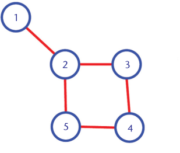

How can this idea be formulated?

First, we assign random values to the embeddings, and on each step, we will set the value of the embedding as the average of embeddings for all the nodes it is directly connected. The following example shows the working on a simple linear graph.

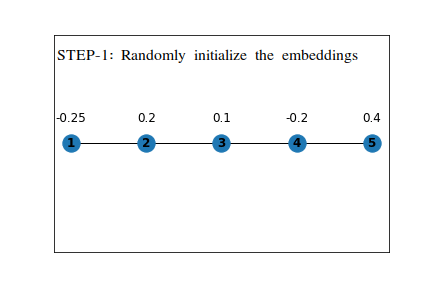

This is a straightforward idea, which can be generalized by representing it in the following way:

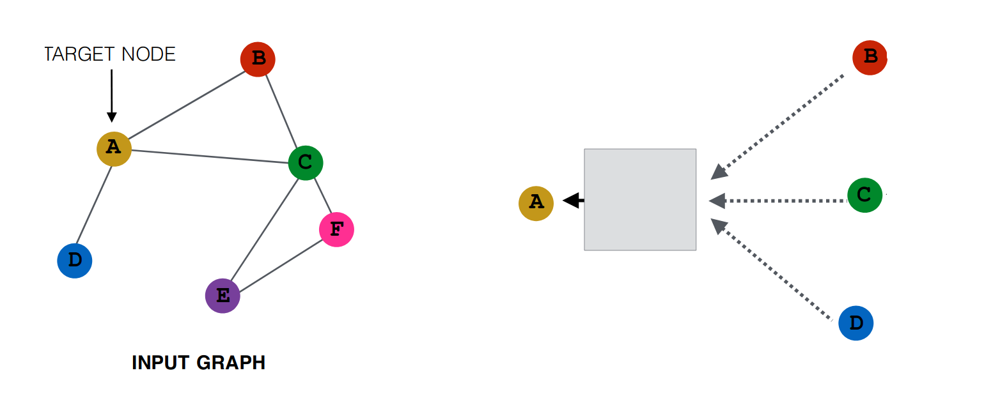

Here The Black Box joining A with B, C, D represents some function of A, B, C, D. (In the above animation, it was the mean function). We can replace this box by any function like say sum or max. This function is known as the aggregator function.

Now let's try to make it more general by using not only the neighbours of a node but also the neighbours of the neighbours. The first question is how to make use of neighbours of neighbours. The way which we will be using here is to first generate each node's embedding in the first step by using only its neighbours just like we did above, and then in the second step, we will use these embeddings to generate the new embeddings. Take a look at the following:

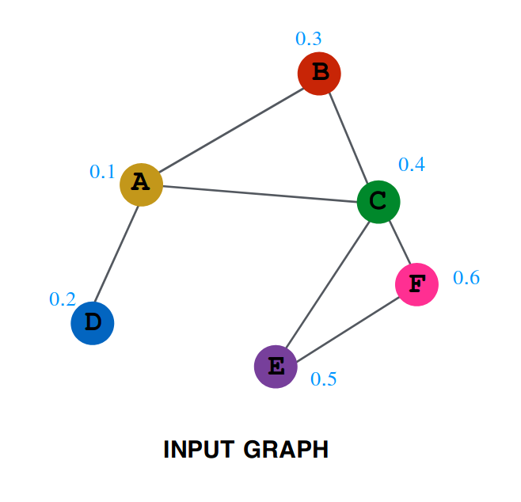

The numbers written along with the nodes are the value of embedding at the time, $T=0$.

Values of embedding after one step are as follows:

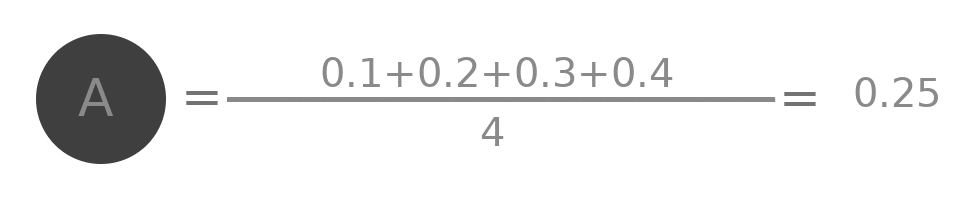

So after one iteration, the values are as follows:

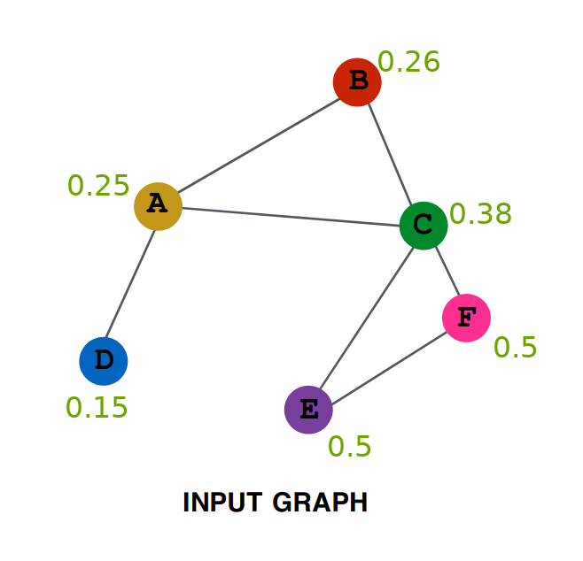

Repeating the same procedure on this new graph, we get (try verifying yourself):

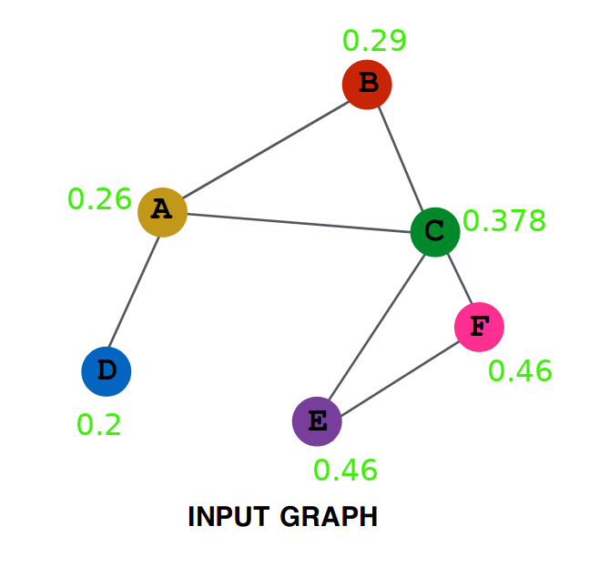

Let's try to do some analysis of the aggregation. Represent by $A^{(0)}$ the initial value of embedding of A (i.e. 0.1), by $A^{(1)}$ the value after one layer (i.e. 0.25) similarly $A^{(2)}$, $B^{(0)}$, $B^{(1)}$ and all other values.

Clearly:

$$A^{(1)} = \frac{(A^{(0)} + B^{(0)} + C^{(0)} + D^{(0)})}{4}$$

Similarly:

$$A^{(2)} = \frac{(A^{(1)} + B^{(1)} + C^{(1)} + D^{(1)})}{4}$$

Writing all the value in the RHS in terms of initial values of embeddings we get:

$$A^{(2)} = \frac{\frac{(A^{(0)} + B^{(0)} + C^{(0)} + D^{(0)})}{4} + \frac{A^{(0)}+B^{(0)}+C^{(0)}}{3} + \frac{A^{(0)}+B^{(0)}+C^{(0)}+E^{(0)} +F^{(0)}}{5} + \frac{A^{(0)}+D^{(0)}}{2}}{4}$$

If you look closely, you will see that all the nodes that were either neighbour of A or neighbour of some neighbour of A are present in this term. It is equivalent to saying that all nodes that have a distance of less than or equal to 2 edges from A are influencing this term. Had there been a node G connected only to node F. then it is clearly at a distance of 3 from A and hence won't be influencing this term.

Generalizing this we can say that if we repeat this procedure N times, then all the nodes (and only those nodes) that are at within a distance N from the node will be influencing the value of the terms.

If we replace the mean function, with some other function, lets say $F$, then, in this case, we can write:

$$A^{(1)} = F(A^{(0)} , B^{(0)} , C^{(0)} , D^{(0)})$$

Or more generally:

$$A^{(k)} = F(A^{(k-1)} , B^{(k-1)} , C^{(k-1)} , D^{(k-1)})$$

If we denote by $N(v)$ the set of neighbours of $v$, so $N(A)=\{B, C, D\}$ and $N(A)^{(k)}=\{B^{(k)}, C^{(k)}, D^{(k)}\}$, the above equation can be simplified as:

$$A^{(k)} = F(A^{(k-1)}, N(A)^{(k-1)} )$$

This process can be visualized as:

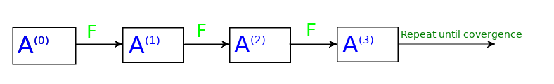

This method is quite effective in generating node embeddings. But there is an issue if a new node is added to the graph how can get its embeddings? This is an issue that cannot be tackled with this type of model. Clearly, something new is needed, but what?

One alternative that we can try is to replace the function F by multiple functions such that in the first layer it is F1, in second layer F2 and so on, and then fixing the number of layers that we want, let's say k.

So our embedding generator would be like this:

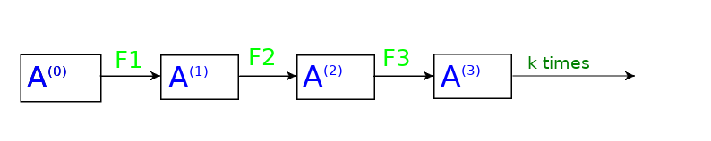

## Notation

Let's formalize our notation a bit now so that it is easy to understand things.

1. Instead of writing $A^{(k)}$ we will be writing $h_{A}^{k}$
2. Rename the functions $F1$, $F2$ and so on as, $AGGREGATE_{1}$, $AGGREGATE_{2}$ and so on. i.e, $Fk$ becomes $AGGREGATE_{k}$.
3. There are a total of $K$ aggregation functions.
4. Let our graph be represented by $G(V, E)$ where $V$ is the set of vertices and $E$ is the set of edges.

## What GraphSAGE Proposes

What we have been doing by now can be written as:

**Initialise** $h_{v}^{0}$ $\forall v \in V$

**for** $k=1..K$ **do**

&nbsp;&nbsp;&nbsp;&nbsp;**for** $v\in V$ **do**

&nbsp;&nbsp;&nbsp;&nbsp;&nbsp;&nbsp;&nbsp;&nbsp;$h_{v}^{k}=AGGREGATE_{k}(h_{v}^{k-1}, \{h_{u}^{k-1} \forall u \in N(v)\})$

$h_{v}^{k}$ will now be containing the embeddings

### Some Issues with This Approach

Please take a look at the sample graph that we discussed above, in this graph even though the initial embeddings for $E$ and $F$ were different, but because their neighbours were same they ended with the same embedding, this is not a good thing as there must be at least some difference between their embeddings.

GraphSAGE proposes an interesting idea to deal with it. Rather than passing both of them into the same aggregating function, what we will do is to pass into aggregating function only the neighbours and then concatenating this vector with the vector of that node. This can be written as:

$$h_{v}^{k}=CONCAT(h_{v}^{k-1},AGGREGATE_{k}( \{h_{u}^{k-1} \forall u \in N(v)\}))$$

In this way, we can prevent two vectors from attaining exactly the same embedding.

Let's now add some non-linearity to make it more expressive. So it becomes:

$$h_{v}^{k}=\sigma[W^{(k)}.CONCAT(h_{v}^{k-1},AGGREGATE_{k}( \{h_{u}^{k-1} \forall u \in N(v)\}))]$$

Where $\sigma$ is some non-linear function (e.g. RELU, sigmoid, etc.) and $W^{(k)}$ is the weight matrix, each layer will have one such matrix. If you looked closely, you would have seen that there is no trainable parameters till now in our model. The $W$ matrix has been added to have something that the model can learn.

One more thing we will add is to normalize the value of h after each iteration, i.e., divide them by their L2 norm, and hence our complete algorithm becomes:

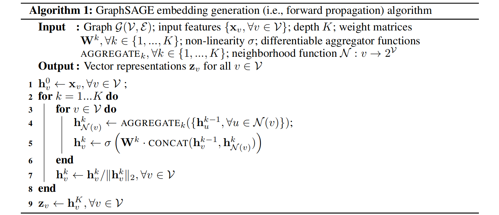

## Loss Function

To get the model learning, we need the loss function. For the general unsupervised learning problem, the following loss problem serves pretty well:

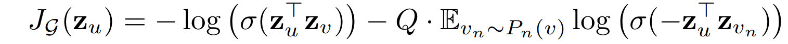

This graph-based loss function encourages nearby nodes to have similar representations, while enforcing that the representations of disparate nodes are highly distinct.

For supervised learning, either we can learn the embeddings first and then use those embeddings for the downstream task or combine both the part of learning embeddings and the part of applying these embeddings in the task into a single end to end models and then use the loss for the final part, and backpropagate to learn the embeddings while solving the task simultaneously.

## Aggregator Architectures

One of the critical differences between GCN and Graphsage is the generalisation of the aggregation function, which was the mean aggregator in GCN. So rather than only taking the average, we use generalised aggregation function in GraphSAGE. GraphSAGE owes its inductivity to its aggregator functions.

### Mean Aggregator

Mean aggregator is as simple as you thought it would be. In mean aggregator we simply take the elementwise mean of the vectors in $\{h_{u}^{k-1} \forall u \in N(v)\}$. In other words, we can average embeddings of all nodes in the neighbourhood to construct the neighbourhood embedding.

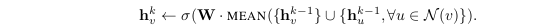

### Pool Aggregator

Until now, we were using a weighted average type of approach. But we could also use pooling type of approach; for example, we can do elementwise min or max pooling. So this would be another option where we are taking the messages from our neighbours, transforming them and applying some pooling technique (max-pooling or min pooling).

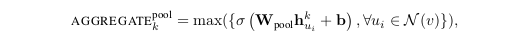

In the above equation, max denotes the elementwise max operator, and $\sigma$ is a nonlinear activation function (yes you are right it can be ReLU). Please note that the function applied before the max-pooling can be an arbitrarily deep multi-layer perceptron, but in the original paper, simple single-layer architectures are preferred.

### LSTM Aggregator

We could also use a deep neural network like LSTM to learn how to aggregate the neighbours. Order invariance is important in the aggregator function, but since LSTM is not order invariant, we would have to train the LSTM over several random orderings or permutation of neighbours to make sure that this will learn that order is not essential.

## Inductive Capability

One interesting property of GraphSAGE is that we can train our model on one subset of the graph and apply this model on another subset of this graph. The reason we can do this is that we can do parameter sharing, i.e. those processing boxes are the same everywhere ($W$ and $B$ are shared across all the computational graphs or architectures). So when a new architecture comes into play, we can borrow the parameters ($W$ and $B$), do a forward pass, and we get our prediction.

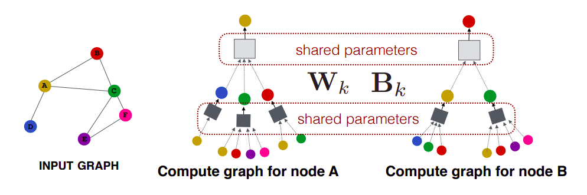

This property of GraphSAGE is advantageous in the prediction of protein interaction. For example, we can train our model on protein interaction graph from model organism A (left-hand side in the figure below) and generate embedding on newly collected data from other model organism say B (right-hand side in the figure).

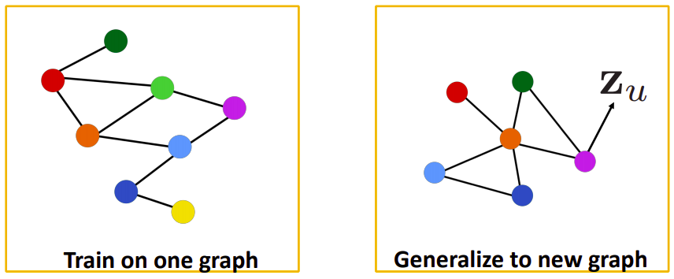

We know that GCN is not able to generalise to a new unseen graph. So, if any new node gets added to the graph, we had to train our model from scratch, but since our new method is generalised to the unseen graphs, so to predict the embeddings of the new node we have to make the computational graph of the new node, transfer the parameters to the unseen part of the graph and we can make predictions.

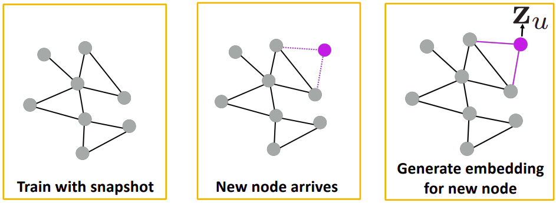

We can use this property in social-network (like Facebook). Consider the first graph in the above figure, users in a social-network are represented by the nodes of the graph. Initially, we would train our model on this graph. After some time suppose another user is added in the network, now we don't have to train our model from scratch on the second graph, we will create the computational graph of the new node, borrow the parameters from the already trained model and then we can find the embeddings of the newly added user.

## Implementation in PyTorch

### Imports

```{python}
import torch
import torch.nn as nn
from torch.nn import init
from torch.autograd import Variable
import torch.nn.functional as F
import numpy as np
import time
import random
from sklearn.metrics import f1_score, accuracy_score
from collections import defaultdict
```

### GraphSAGE Classes

Here, we define the classes for the mean aggregator, encoder and supervised GraphSAGE model. 

* The mean aggregator class is responsible for aggregating the embeddings of the neighbours of a node using the mean function.
* The encoder class is responsible for encoding a node's embedding using the 'convolutional' GraphSAGE approach. 
* The supervised GraphSAGE class combines the encoder with a linear layer to perform classification.

```{python}
"""
Simple supervised GraphSAGE model as well as examples running the model on the Cora and Pubmed datasets.
"""

class MeanAggregator(nn.Module):
    """
    Aggregates a node's embeddings using mean of neighbors' embeddings
    """
    def __init__(self, features, cuda=False, gcn=False): 
        """
        Initializes the aggregator for a specific graph.
        features -- function mapping LongTensor of node ids to FloatTensor of feature values.
        cuda -- whether to use GPU
        gcn --- whether to perform concatenation GraphSAGE-style, or add self-loops GCN-style
        """

        super(MeanAggregator, self).__init__()

        self.features = features
        self.cuda = cuda
        self.gcn = gcn
        
    def forward(self, nodes, to_neighs, num_sample=10):
        """
        nodes --- list of nodes in a batch
        to_neighs --- list of sets, each set is the set of neighbors for node in batch
        num_sample --- number of neighbors to sample. No sampling if None.
        """
        # Local pointers to functions (speed hack)
        _set = set
        if not num_sample is None:
            _sample = random.sample
            samp_neighs = [_set(_sample(list(to_neigh), 
                            num_sample,
                            )) if len(to_neigh) >= num_sample else to_neigh for to_neigh in to_neighs]
        else:
            samp_neighs = to_neighs

        if self.gcn:
            samp_neighs = [samp_neigh + set([nodes[i]]) for i, samp_neigh in enumerate(samp_neighs)]
        unique_nodes_list = list(set.union(*samp_neighs))
        unique_nodes = {n:i for i,n in enumerate(unique_nodes_list)}
        mask = Variable(torch.zeros(len(samp_neighs), len(unique_nodes)))
        column_indices = [unique_nodes[n] for samp_neigh in samp_neighs for n in samp_neigh]   
        row_indices = [i for i in range(len(samp_neighs)) for j in range(len(samp_neighs[i]))]
        mask[row_indices, column_indices] = 1
        if self.cuda:
            mask = mask.cuda()
        num_neigh = mask.sum(1, keepdim=True)
        mask = mask.div(num_neigh)
        if self.cuda:
            embed_matrix = self.features(torch.LongTensor(unique_nodes_list).cuda())
        else:
            embed_matrix = self.features(torch.LongTensor(unique_nodes_list))
        to_feats = mask.mm(embed_matrix)
        return to_feats

class Encoder(nn.Module):
    """
    Encodes a node's using 'convolutional' GraphSage approach
    """
    def __init__(self, features, feature_dim, 
            embed_dim, adj_lists, aggregator,
            num_sample=10,
            base_model=None, gcn=False, cuda=False, 
            feature_transform=False): 
        super(Encoder, self).__init__()

        # the graph structure
        self.features = features
        self.feat_dim = feature_dim
        self.adj_lists = adj_lists
        self.aggregator = aggregator
        self.num_sample = num_sample
        if base_model != None:
            self.base_model = base_model

        self.gcn = gcn
        self.embed_dim = embed_dim
        self.cuda = cuda
        self.aggregator.cuda = cuda
        self.weight = nn.Parameter(
                torch.FloatTensor(embed_dim, self.feat_dim if self.gcn else 2 * self.feat_dim))
        init.xavier_uniform(self.weight)

    def forward(self, nodes):
        """
        Generates embeddings for a batch of nodes.
        nodes     -- list of nodes
        """
        neigh_feats = self.aggregator.forward(nodes,
                    [self.adj_lists[int(node)] for node in nodes], self.num_sample)
        if not self.gcn:
            if self.cuda:
                self_feats = self.features(torch.LongTensor(nodes).cuda())
            else:
                self_feats = self.features(torch.LongTensor(nodes))
            combined = torch.cat([self_feats, neigh_feats], dim=1)
        else:
            combined = neigh_feats
        combined = F.relu(self.weight.mm(combined.t()))
        return combined


class SupervisedGraphSage(nn.Module):

    def __init__(self, num_classes, enc):
        super(SupervisedGraphSage, self).__init__()
        self.enc = enc
        self.xent = nn.CrossEntropyLoss()

        self.weight = nn.Parameter(torch.FloatTensor(num_classes, enc.embed_dim))
        init.xavier_uniform(self.weight)

    def forward(self, nodes):
        embeds = self.enc(nodes)
        scores = self.weight.mm(embeds)
        return scores.t()

    def loss(self, nodes, labels):
        scores = self.forward(nodes)
        return self.xent(scores, labels.squeeze())
```

### Load and Run

We will define a function to import and transform the Cora dataset and another function that runs the whole workflow. Please note, in each Encoder layer, we are not using the entire graph structure but only the part of the graph that is relevant to the nodes in the current batch of training nodes. In the testing phase, the trained model can be applied to predict the labels of the test set, which is unseen in the training process. This is the inductive property of GraphSAGE and its advantage over GCN.

Note that the GraphSAGE model consists of three layers (not including features), with the following input/output dimensions:

| Component | Level | Input Dimension | Output Dimension |
|-----------|-------|-----------------|------------------|
| Features | Raw Data | - | 1433 |
| Encoder 1 | 1-Hop Neighbours | 1433 | 128 |
| Encoder 2 | 2-Hop Neighbours | 128 | 128 |
| GraphSAGE | Classification | 128 | 7 (Classes) |

```{python}
def load_cora():
    dataset = Planetoid(root='/tmp/Cora', name='Cora')
    data = dataset[0]
    # data contains the following attributes:
    # data.x -> feature matrix (stored as a sparse matrix)
    # data.y -> labels
    # data.edge_index -> adj_lists (stored as a coordinate list/COO matrix)
    feat_data = data.x.numpy()
    labels = data.y.numpy().reshape(-1, 1)

    adj_lists = defaultdict(set)
    edges = data.edge_index.numpy()
    
    for i in range(edges.shape[1]):
        u, v = edges[0, i], edges[1, i]
        adj_lists[u].add(v)
        adj_lists[v].add(u)

    return feat_data, labels, adj_lists

def run_cora():
    np.random.seed(1)
    random.seed(1)
    
    # number of nodes 2708
    # feat_data: contains 2708 rows (papers) and 1433 columns (words). The value of the entry (i, j) is 1 if the word j is present in the paper i and 0 otherwise.
    feat_data, labels, adj_lists = load_cora()
    num_nodes = feat_data.shape[0]
    
    # Instead of a simple matrix, the features are wrapped in an Embedding layer nn.Embedding. 
    # Setting requires_grad=False means the original paper attributes are fixed and won't be changed by the optimiser; only the aggregation weights will be learned.
    features = nn.Embedding(feat_data.shape[0], feat_data.shape[1])
    features.weight = nn.Parameter(torch.FloatTensor(feat_data),
                                   requires_grad=False)

    # Layer 1: The First Neighbourhood Hop
    # MeanAggregator (agg1): defines how to combine information. It takes the features of all neighbours and calculates their average.
    # Encoder (enc1): the first "hop." It takes the raw features (size 1433) and compresses them into a more meaningful representation (size 128) by using the aggregator and the adj_lists.
    # num_samples = 5: GraphSAGE doesn't always look at every neighbour, which can be computationally expensive. Here, it randomly picks 5 neighbours at each layer to sample from. If a node has fewer than num_samples, the algorithm typically uses sampling with replacement.
    agg1 = MeanAggregator(features, cuda=True)
    
    enc1 = Encoder(features, feat_data.shape[1], 128, adj_lists, agg1, gcn=True,
                          cuda=False)
    enc1.num_samples = 5

    # Layer 2: The Second Neighbourhood Hop
    agg2 = MeanAggregator(lambda nodes : enc1(nodes).t(),
                          cuda=False)
    enc2 = Encoder(lambda nodes : enc1(nodes).t(),
                   enc1.embed_dim, 128, adj_lists, agg2, 
                   base_model=enc1, gcn=True, cuda=False)
    enc2.num_samples = 5

    # Final Layer for predicting the class (out of 7)
    graphsage = SupervisedGraphSage(7, enc2)

    # randomly shuffle the node index and using the first 1500 nodes for testing and 2708-1500=1208 nodes for training.
    rand_indices = np.random.permutation(num_nodes)
    test = rand_indices[:1500]
    train = list(rand_indices[1500:])

    optimizer = torch.optim.SGD(filter(lambda p : p.requires_grad,
                                       graphsage.parameters()), lr=0.7)
    times = []
    
    # We train this model in 100 batches. In each batch, only a subset of the training nodes (256 nodes) are used to calculate the loss and update the weights. This is common in large-scale graph learning in order to speed up the training process, as using all the training nodes in each batch can be computationally expensive.
    for batch in range(100):
        batch_nodes = train[:256]
        random.shuffle(train)
        start_time = time.time()
        optimizer.zero_grad()
        loss = graphsage.loss(batch_nodes, 
                Variable(torch.LongTensor(labels[np.array(batch_nodes)])))
        loss.backward()
        optimizer.step()
        end_time = time.time()
        times.append(end_time-start_time)
        print (batch, loss.item())

    print ("Average batch time:", np.mean(times))

    # accuracy on testing data
    test_output = graphsage.forward(test)
    
    pred = test_output.data.numpy().argmax(axis=1)
    accuracy = accuracy_score(labels[test], pred)
    print ("Test Accuracy:", accuracy)

if __name__ == "__main__":
    run_cora()
```

So, what do you think about the accuracy of the model? Do you think it is good enough in predicting the labels of new nodes?

## Conclusion

We've trained several GCN and GraphSAGE models for making predictions of node classification on two datasets. The code can be easily adapted to other graph datasets, as the classes defined here are quite general. What you need to do is to rewrite the load_* and run_* functions (like load_cora and run_cora) to load your dataset and train the model on it.

## References

- This notebook is heavily based on the [graph_nets Github repo](https://github.com/dsgiitr/graph_nets). Highly recommended.
- [Graph Node Embedding Algorithms (Stanford - Fall 2019) by Jure Leskovec](https://www.youtube.com/watch?v=7JELX6DiUxQ)
- [Jure Leskovec: "Large-scale Graph Representation Learning"](https://www.youtube.com/watch?v=oQL4E1gK3VU)
- [Jure Leskovec "Deep Learning on Graphs"](https://www.youtube.com/watch?v=MIAbDNAxChI)
