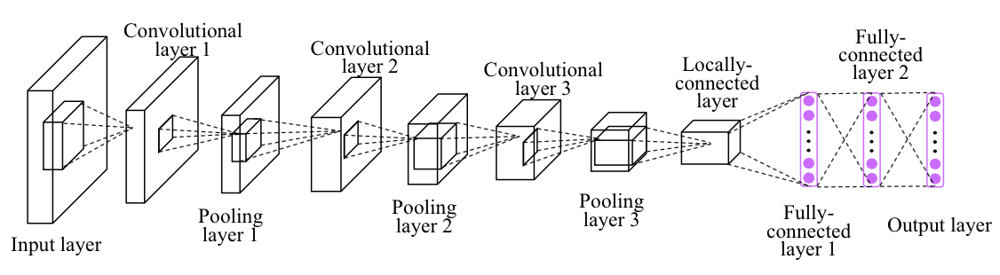
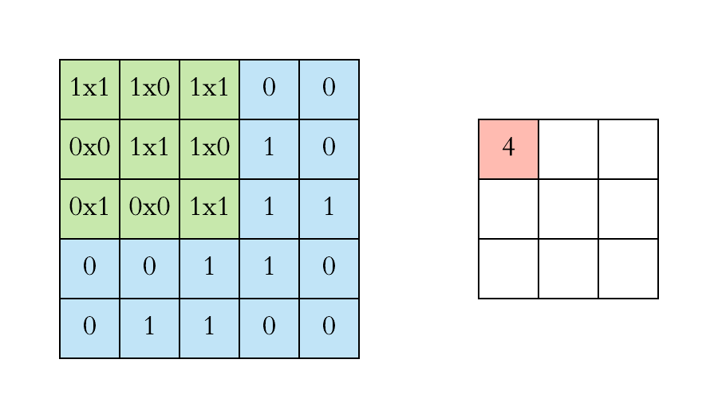
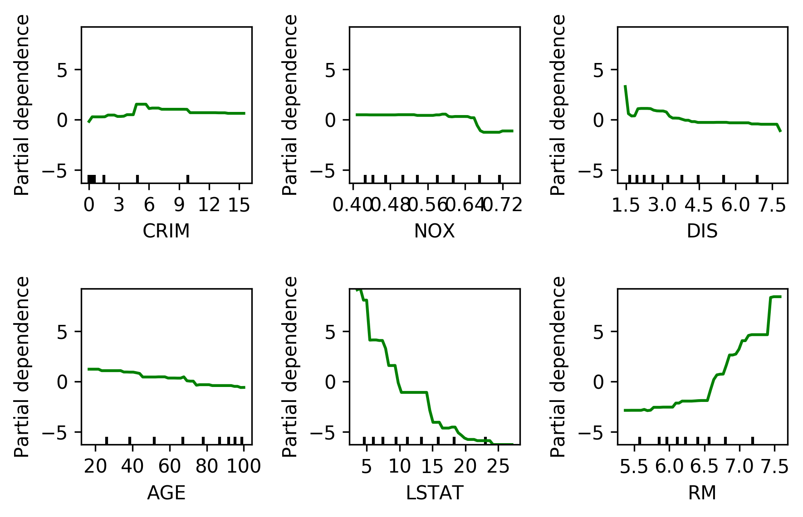
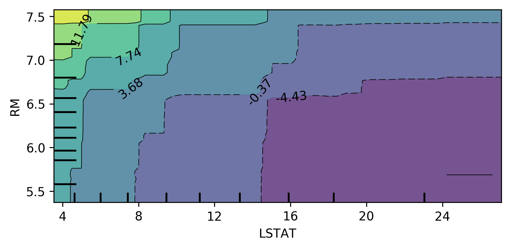
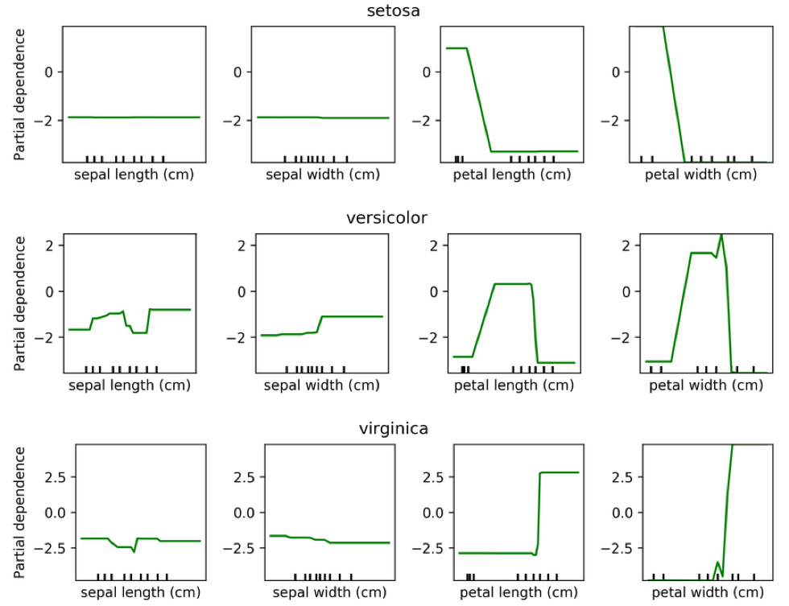
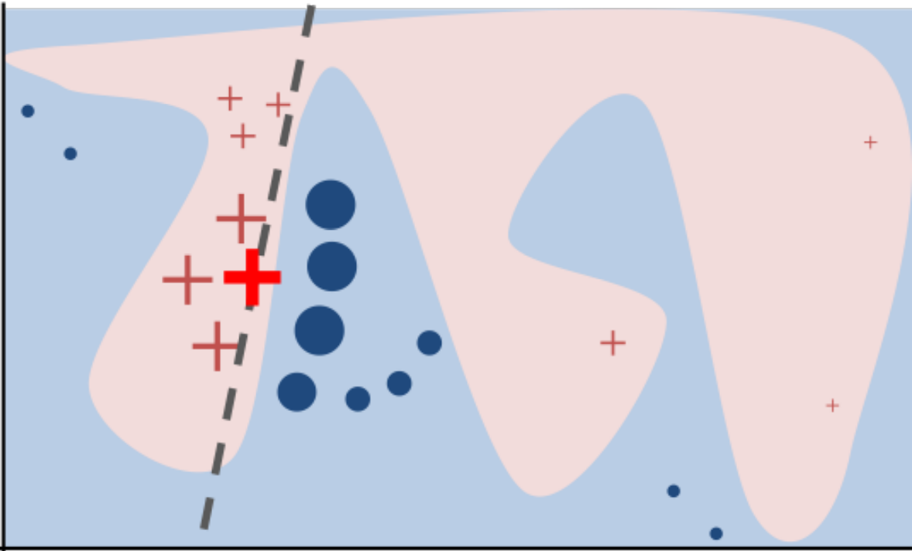
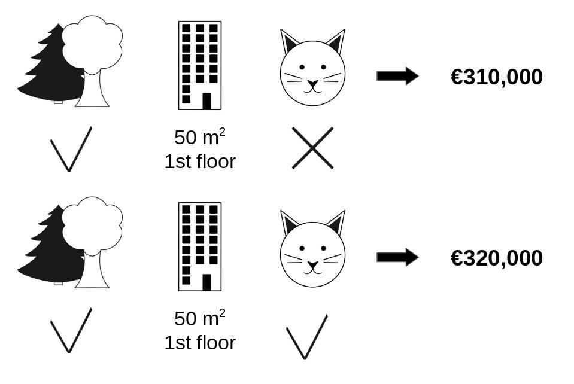
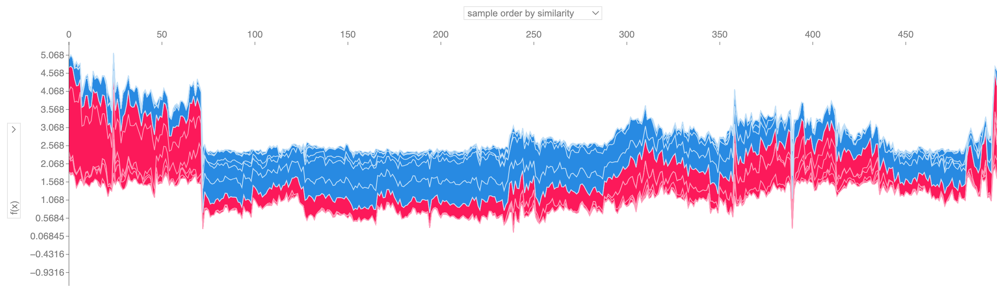
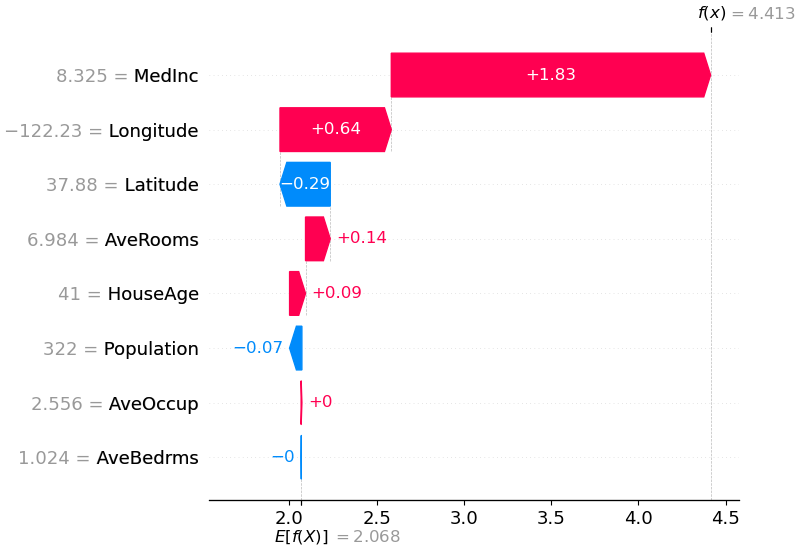

```{notes}
TODO: update feature selection part
```

## Recap: Neural Networks (or MLP)

<div style="text-align:center;">
  
</div>

## Recap: Convolutional Neural Networks (CNN)

- Local filter
- Translation invariance

<div style="text-align:center;">
  
</div>

<div style="text-align:center;">
  
</div>

[source: Arden Dertat](https://towardsdatascience.com/applied-deep-learning-part-4-convolutional-neural-networks-584bc134c1e2)

## Recap: Graph Neural Networks (GNN)

<div style="text-align:center;">
  
</div>

## From this week ...

- No new algorithms
- More on how to apply and interpret models
- **W07: Model interpretation techniques**
- W08: Feature selection methods
- W09: Testing ML codes
- W10: Handling imbalanced data

## Model Interpretation (Post-hoc Explanability)

- It involves taking [a pre-trained model]{style="color: blue;"} and using [a separate method]{style="color: blue;"} to explain its decisions
- It belongs to a broader field of *Interpretable Machine Learning* and *Explainable AI (XAI)*
- It differs from *interpretable models* (e.g., linear regression, decision trees), which are designed to be inherently interpretable

## What Post-hoc Explanability isn't ...

- This is NOT inference or estimating variable relationships
- This is NOT causality
- Still useful for feature selection and understanding black-box model behaviours

## Explaining the Model != Explaining the Data

- Model inspection only tells you about the model
- The model might not accurately reflect the data
- Don't explain a model with low accuracy

# Two types of Post-hoc Explanations

## Explain model globally
- [How does the model depend on each feature?]{style="color: blue;"}
- Often in some form of marginals (e.g., `feature importance`)
- Note that there many types of "feature importance"  and they can give very different results!
- Always ask one question: "what is the definition of feature importance?"

## Explain model locally
- Why did it classify this data point this way?
- Explanation will be different for each point
- *"What is the minimum change to classify it differently?"*

## Methods

:::: columns

::: {.column width="50%"}
**Global:**

- Coefficients (:x:)
- Sklearn feature importance (:x:)
- Drop-feature importance (:x:)
- [Permutation importance]{style="color: blue;"} (:heavy_check_mark:)
- [Partial dependence plots]{style="color: blue;"} (:heavy_check_mark:)

:::

::: {.column width="50%"}
**Local:**

- [LIME]{style="color: blue;"} (:heavy_check_mark:)
- [SHAP values]{style="color: blue;"} (:heavy_check_mark:)

:::

::::

<!-- ## Linear Model Coefficients

- $$y = 7.82x_1 + 2.15x_2 + 9.31x_3 + 1.64x_4 + 5.88x_5 + 3.47 $$
- The coefficient 7.82 for $x_1$ tells how y changes with a unit change in $x_1$, holding other features constant
- However, coefficients do not indicate relative feature importance
- We can't say $x_3$ is more important than $x_1$ just because 9.31 > 7.82 
- Use with care!

## Trap #1

- Only compare the coefficients after features are standardised (with mean=0 and std=1)
- Suppose you are modelling house prices
- Variable A: Square footage (range: 500 to 5,000), coef = 100
- Variable B: Number of bedrooms (range: 1 to 5), coef = 10,000
- Without standardisation, can't compare coef of A and B

## Trap #2

- Even after standardisation ...
- If features are correlated, coefficients can be inflated or unstable


## Linear Model Coefficients

- Large absolute coef value != important feature
- Relative importance only meaningful after scaling
- Correlation among features might make coefficients completely uninterpretable
- L1 regularisation will pick one at random from a correlated group
- Any penalty will invalidate usual interpretation of linear coefficients

## Example: Correlated Features

- Correlation among features might make coefficients completely uninterpretable

```{python}
#| echo: false
## Example
import numpy as np
from sklearn.linear_model import LinearRegression
from sklearn.datasets import make_regression

# Generate data with 3 uncorrelated features and R2=0.8
X, y = make_regression(n_samples=100, n_features=3, n_informative=3, 
             noise=10, random_state=42)

# Verify low correlation
print("Correlations (should be < 0.1):")
print(np.corrcoef(X.T))

# Fit model and print formula
model1 = LinearRegression().fit(X, y)
formula1 = f"y = {model1.intercept_:.2f} + {model1.coef_[0]:.2f}*X1 + {model1.coef_[1]:.2f}*X2 + {model1.coef_[2]:.2f}*X3"
print(f"\nModel 1 (3 features): {formula1}")
print(f"R² = {model1.score(X, y):.3f}")

# Add X4 correlated with X3 (cor=0.9)
X4 = 0.9 * X[:, 2] + 0.1 * np.random.randn(X.shape[0])
X_with_X4 = np.column_stack([X, X4])

print(f"\nCorrelation X3-X4: {np.corrcoef(X[:, 2], X4)[0, 1]:.3f}")

# Fit model with X4
model2 = LinearRegression().fit(X_with_X4, y)
formula2 = f"y = {model2.intercept_:.2f} + {model2.coef_[0]:.2f}*X1 + {model2.coef_[1]:.2f}*X2 + {model2.coef_[2]:.2f}*X3 + {model2.coef_[3]:.2f}*X4"
print(f"\nModel 2 (4 features): {formula2}")
print(f"R² = {model2.score(X_with_X4, y):.3f}")
```

## Example: linear regression with penalisation

- Lasso regression performs feature selection by driving some coefficients to zero
- $\text{Lasso Regression: } \min_{\beta} \left( \frac{1}{2n} \sum_{i=1}^{n} (y_i - X_i \beta)^2 + \lambda \|\beta\|_1 \right)$
- On the same data, Lasso regression will pick one of the correlated features (X3 or X4)
- but it doesn't mean the dropped feature is unimportant!

```{python}
#| echo: false
from sklearn.linear_model import LassoCV
from sklearn.preprocessing import StandardScaler
from sklearn.pipeline import make_pipeline

# Scale the features
X_scaled = StandardScaler().fit_transform(X)

# Fit Lasso model with cross-validation to find the best alpha
lasso = LassoCV(cv=10).fit(X_scaled, y)

# # Print the coefficients and the best alpha
# print("Best alpha:", lasso.alpha_)
# print("Coefficients:", lasso.coef_)

# # Print selected features
selected_features = np.where(lasso.coef_ != 0)[0]
# print("Selected features:", selected_features)

# Construct the formula
formula = "Y = {:.2f}".format(lasso.intercept_)
for idx in selected_features:
  formula += " + {:.2f}*X{}".format(lasso.coef_[idx], idx + 1)
print(formula)

```

## feature_importances_ in sklearn tree-based Models

- For a tree: FI = total reduction of the criterion (e.g., Gini, MSE) brought by that feature
- For a forest: average FI over all trees
- Problems:
  - Biased towards high-cardinality features (cardinality = number of unique values)
  - Can be misleading when features are correlated

## Drop Feature Importance (Not recommended)

$$I_i^\text{drop} = \text{Acc}(f, X, y) - \text{Acc}(f', X_{-i}, y)$$

<!-- ```python
def drop_feature_importance(est, X, y):
    base_score = np.mean(cross_val_score(est, X, y))
    scores = []
    for feature in range(X.shape[1]):
        mask = np.ones(X.shape[1], 'bool')
        mask[feature] = False
        X_new = X[:, mask]
        this_score = np.mean(cross_val_score(est, X_new, y))
        scores.append(base_score - this_score)
    return np.array(scores)
``` -->

<!-- 
- It refits a new model for each feature removal
- Doesn't really explain model (refits for each feature)
- Can't deal with correlated features well
- Be cautious!
 -->
 
## Permutation Importance

Idea: measure marginal influence of a feature by permuting it and measuring the drop in accuracy
<div style="text-align:center;">
  
</div>

## Permutation Importance

$$I_i^\text{perm} = \text{Acc}(f, X, y) - \mathbb{E}_{x_i}\left[\text{Acc}(f(x_i, X_{-i}), y)\right]$$

```python
def permutation_importance(est, X, y, n_repeat=100):
  baseline_score = estimator.score(X, y)
  for f_idx in range(X.shape[1]):
      for repeat in range(n_repeat):
          X_new = X.copy()
          X_new[:, f_idx] = np.random.shuffle(X[:, f_idx])
          feature_score = estimator.score(X_new, y)
          scores[f_idx, repeat] = baseline_score - feature_score
```

- Stay with the same trained model
- Model agnostic (works for any ML model)
- Can deal with correlated features better
- Can maintain the distribution of a feature
- Can run slow (need to re-evaluate models many times: n_features * n_repeats model evaluations)

## Alternatives of permutation importance

- Drop-feature importance (*not recommended*)
- Idea: to measure importance of x1 for y=f(x1, x2, x3), it drops x1 and refits y=g(x2, x3), and then compare accuracy of f() and g()
- It refits a new model for each feature removal
- Doesn't really explain model (refits for each feature)
- Can't deal with correlated features well

## Alternatives of permutation importance

- sklearn tree-based feature importance 
- Only applicable to tree-based models in sklearn
- For a tree: FI = total reduction of the criterion (e.g., Gini, MSE) brought by that feature
- For a forest: average FI over all trees

## Problems with sklearn tree-based feature importance

- Biased towards high-cardinality features (cardinality = number of unique values)
- Can be misleading when features are correlated
- Not recommended

```python
from sklearn.ensemble import RandomForestRegressor
model = RandomForestRegressor()
model.fit(X_train, y_train)
importances = model.feature_importances_ # sklearn tree-based feature importance
PI = permutation_importance(model, X_train, y_train, n_repeats=10,
                                random_state=0) # permutation importance
```

## Partial Dependence Plots

- Marginal dependence of prediction on one (or two) features across differnt values

$$f_i^{\text{pdp}}(x_i) = \mathbb{E}_{X_{-i}}\left[f(x_i, x_{-i})\right]$$

- Idea: Get marginal predictions given feature
- How? "Integrate out" other features using validation data

## PDP

```python
from sklearn.inspection import plot_partial_dependence
boston = load_boston()
X_train, X_test, y_train, y_test = train_test_split(boston.data, boston.target,random_state=0)

gbrt = GradientBoostingRegressor().fit(X_train, y_train)

fig, axs = plot_partial_dependence(gbrt, X_train, np.argsort(gbrt.feature_importances_)[-6:], feature_names=boston.feature_names)
```

<div style="text-align:center;">
  
</div>

## Bivariate Partial Dependence Plots

```python
plot_partial_dependence(
    gbrt, X_train, [np.argsort(gbrt.feature_importances_)[-2:]],
    feature_names=boston.feature_names, n_jobs=3, grid_resolution=50)
```

<div style="text-align:center;">
  
</div>

## Partial Dependence for Classification

```python
from sklearn.inspection import plot_partial_dependence
for i in range(3):
    fig, axs = plot_partial_dependence(gbrt, X_train, range(4), n_cols=4,
                                       feature_names=iris.feature_names, grid_resolution=50, label=i)
```

<div style="text-align:center;">
  
</div>

## LIME

- Build sparse linear local model around each data point
- Explain prediction for each point locally
- Paper: "Why Should I Trust You?" Explaining the Predictions of Any Classifier
- Implementation: ELI5, https://github.com/marcotcr/lime

<div style="text-align:center;">
  
</div>

## SHAP

- Build around idea of Shapley values (from game theory, proposed by Lloyd Shapley in 1953)
- Shapley values: a fair way to distribute "payout" among N players in a game, based on their marginal contributions across all possible coalitions

## Shapley value

- A fair way to distribute "payout" among N players in a game
- Example in housing price: how much does each factor contribute to the house price?
- What we want to see: park-nearby contributed €30,000; area-50 contributed €10,000; floor-2nd contributed €0; cat-ban contributed -€50,000. But HOW?

<div style="text-align:center;">
  
</div>

## Shapley value (cont.)

- Checking all possible coalition ...

<div style="text-align:center;">
  
</div>

## Shapley value (cont.)

- To compute payout for cat-ban, we need to check the following combinations (with & without cat-ban), and take the difference in predicted price. The payout of cat-bin is the (weighted) average of these differences across all combinations.
- If a feature is not in the coalition, we replace it with some baseline (e.g. mean).
  - park-nearby, area-50, floor-2nd
  - park-nearby, area-50
  - park-nearby, floor-2nd
  - area-50, floor-2nd
  - park-nearby
  - area-50
  - floor-2nd
  - {} (empty coalition)

## Shapley value (game theory)

- Assume 4 players, to compute Shapley value for player 1:
  - Consider all subsets of players not including player 1: {}, {2}, {3}, {4}, {2,3}, {2,4}, {3,4}
  - For each subset S, compute marginal contribution of player 1: v(S ∪ {1}) - v(S)
  - Weight each marginal contribution by the number of ways to arrange players in S and N \ S \ {1}
  - Sum weighted contributions to get φ₁(v)

## Shapley value

- Example of Shapley value for bike rental prediction
- The sum of Shapley values yields the difference of actual and average prediction (422).
- The temperature & humidity had the largest positive contributions.

<div style="text-align:center;">
  
</div>

## Shapley value (game theory)

- Shapley value is the only attribution method that satisfies following properties

- *Efficiency*: sum of attributions = difference between actual output and average output
- *Symmetry*: if two features contribute equally, they get same attribution
- *Dummy*: if a feature does not affect the output, its attribution is zero
- *Additivity*: for two models, attributions add up. (Think about a random forest with many trees, the Shapley values of the forest is the avereage of SHAP values of each tree)

## From Shapely values to SHAP

- SHAP (SHapley Additive exPlanations) is a unified framework for explaining ML predictions, based on Shapley values
- Shapely values were proposed in 1953
- In 2017, Lundberg and Lee proposed SHAP for explaining ML models.
 - assume the explanation as a linear model of binary variables indicating presence/absence of features
 - allows local / per sample explanations, and global explanations (by averaging)
 - introduced effecient estimation of KernelSHAP and TreeSHAP

## SHAP

SHAP assumes the prediction of a data point is the sum of effects of each feature. It defines:

 $$g(z') = \phi_0 + \sum_{i=1}^{M} \phi_i z'_i$$

- $\phi_0$: The base value (the average prediction of the model across the dataset).
- $\phi_i$: The SHAP value (the contribution of feature $i$).
- $z'_i \in \{0, 1\}^M$: A binary vector representing whether a feature is *present* or *absent*.
- $M$: The number of input features.

## Computing SHAP

- The original Shapley values are computationally expensive (exponential in number of features)
- SHAP introduced efficient estimation methods:
- **KernelSHAP**: model-agnostic, uses sampling to estimate SHAP values (model agnostic)
- **Permutation SHAP**: approximate method using permutations, similar to permutation importance
- **TreeSHAP**: efficient exact computation **for tree-based models**

## SHAP example

- Y variable: median house value for California districts (in $100,000)
- 8 features 
    - MedInc        median income in block group
    - HouseAge      median house age in block group
    - AveRooms      average number of rooms per household
    - AveBedrms     average number of bedrooms per household
    - Population    block group population
    - AveOccup      average number of household members
    - Latitude      block group latitude
    - Longitude     block group longitude
- Spatial unit: A block group is the smallest geographical unit for which the U.S. Census Bureau publishes sample data; typically with a population of 600 to 3,000 people.
- Source: https://www.dcc.fc.up.pt/~ltorgo/Regression/cal_housing.html

## SHAP waterfall plot

```python
import xgboost
import shap

X, y = shap.datasets.california() # 20640 instances, 8 features
model = xgboost.XGBRegressor().fit(X, y)

explainer = shap.Explainer(model)
shap_values = explainer(X)
shap.plots.waterfall(shap_values[0])
```

<div style="text-align:center;">
  
</div>

## SHAP force plots

```python
shap.plots.force(shap_values[0])
```
<div style="text-align:center;">
  
</div>

## SHAP force plots for multiple samples

```python
shap.plots.force(shap_values[:500])
```

<div style="text-align:center;">
  
</div>

- Use with caution!

## SHAP Summary Plot

```python
shap.plots.beeswarm(shap_values)
```

<div style="text-align:center;">
  
</div>

## SHAP Feature Importance

- the mean absolute values of SHAP can be averaged across samples to get global feature importance
```python
shap.plots.bar(shap_values)
```

<div style="text-align:center;">
  
</div>

## GeoShapley

- Explains any model that takes tabular data + spatial features (e.g., coordinates)

<div style="text-align:center;">
  
  Source: https://github.com/Ziqi-Li/geoshapley
</div>

## Key Takeaways

- Model interpretation is about explaining a trained model, not the data
- Post-hoc explanations can be global (feature importance, PDP, SHAP) or local (LIME, SHAP)
- **Permutation importance** is better than drop-feature importance and sklearn tree-based feature importance
- **SHAP** is a unified framework for explaining ML predictions, based on Shapley values from game theory
- **SHAP** is different from Shapley values!
- These methods are model agnostic

## Questions?
