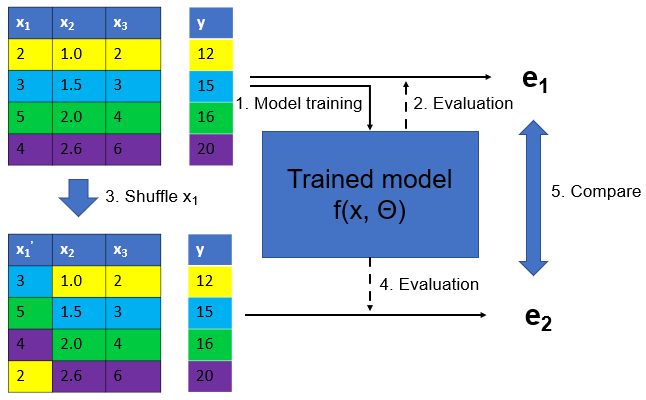

<!-- ```{notes}
TODO: update feature selection part

Outline
- Why selecting features?
- Feature selection methods
  - Unsupervised feature selection (based on only the features, not the target): variance, covariance, PCA
  - Supervised feature selection (based on their relationship with the target variable): univariate statistics, mutual information, model-based selection, wrapper methods
- Feature selection for linear models: Lasso
- Feature selection for machine learning models: mutual information, feature importance, RFECV

``` -->

## Recap

- Model interpretation is about explaining a trained model, not the data
- **Post-hoc explanations** can be global (feature importance, PDP, SHAP) or local (LIME, SHAP)
- **Permutation importance** is better than drop-feature importance and sklearn tree-based feature importance
- **SHAP** is a unified framework for explaining ML predictions, based on *Shapley values* from game theory
- These methods are model agnostic

## This week

- Focus on **feature selection** for supervised machine learning models
- Understand the classification of feature selection methods (unsupervised vs supervised)
- Can apply classic feature selection methods for supervised machine learning models

## Definition

- Selecting [a subset of relevant features]{style="color: blue;"} for supervised machine learning.
- Features are also called X variables, independent variables, or input variables.
- Why Selecting Features?
  - Faster model training
  - Lower cost for data collection
  - More interpretable model
- Caveat: might compromise model performance if some features are discarded

## How many features are needed?

- No golden rule, but some heuristics:
  - 10-20 samples per feature (or #features ~ #samples / 10)
  - a predefined number of features, usually 10 or 20
  - Using elbow method (model performance vs. # features) to decide #features

## Two Types of Feature Selection

- Unsupervised FS: based solely on the features, without considering the target variable
  - Example: variance-based, covariance-based, PCA, VIF
- Supervised FS: based on the relationship between features and the target variable
  - Example: Lasso, mutual information, tree-based feature importance

:::{.callout-note}
This classification is different from unsupervised vs supervised machine learning.
:::

## Our Selection of Methods

- VIF (for linear models)
- Lasso (for linear models)
- Mutual information (model agnostic)
- Permutation importance (model agnostic)
- RFECV (model agnostic)

# VIF (Variance Inflation Factor)

## VIF

- For **addressing multicollinearity** in **linear regression**
- Unsupervised feature selection (y is not involved)
- Iterative process. In each step, remove one or zero features
- The VIF of a feature is: $\text{VIF} = \frac{1}{1 - R^2}$, where $R^2$ is R2 of a regression of that feature on all the other features.

## VIF

<div style="text-align:center;">
  
</div>

## VIF Example

# Lasso (Least Absolute Shrinkage and Selection Operator)

## Lasso definition

- Lasso is a linear regression model with L1 regularisation, which shrinks some coefficients to zero. 
- Features with zero coeffcients are effectively removed.
- L1 norm of a vector: $\|\mathbf{x}\|_1 = \sum_{i=1}^{n} |x_i|$
- α is hyperparameter that controls regularisation. 
- Higher α means more regularisation, which leads to more discarded features.

|  | OLS | Lasso |
|---|---|---|
| Formula | $y = X\beta$ | $y = X\beta$ |
| To minimise | $\min_{\beta} \left\{ \frac{1}{2n} \sum_{i=1}^{n} (y_i - \mathbf{x}_i^T \beta)^2 \right\}$ | $\min_{\beta} \left\{ \frac{1}{2n} \sum_{i=1}^{n} (y_i - \mathbf{x}_i^T \beta)^2 + \alpha \|\beta\|_1 \right\}$ |

## Comparing VIF and Lasso

|  | VIF | Lasso |
|--------|-----|-------|
| **Purpose** | Addresses multicollinearity | Feature selection, including address multicollinearity |
| **Type** | Unsupervised | Supervised |
| **When** | Before linear regression | Embedded in linear regression |
| **Output** | Selected features | Features with non-zero coefficients |
| **Model Type** | Linear regression | Linear regression |

# Mutual information

## MI definition

- MI measures how much information X and Y share.
- $I(X; Y) = H(X) - H(X|Y)$, where $H(X)$ is the entropy (uncertainty) of X, and $H(X|Y)$ is the conditional entropy of X given Y.
- Entropy of a variable X: $H(X) = -\sum_{x} P(x) \log P(x)$, where $P(x)$ is the probability of X taking value x.

<div style="text-align:center;">
  
</div>

## MI properties

- MI is similar to Pearson correlation, but more general, as it can capture non-linear relatiionships.
- MI is **non-negative**. MI=0 means X and Y are independent; higher MI means stronger relationship between X and Y.
- MI is **Symmetric**: $I(X; Y) = I(Y; X)$.
- MI is **model-independent**: similar to Pearson correlation.

## MI example: California Housing

- California housing dataset (from `sklearn`): 20,640 houses in California, each described by 8 numeric features (e.g., median income, house age, latitude)
- Target variable: **median house value** (continuous)

## MI: median_house_value vs each feature

```{python}
#| echo: false
import pandas as pd
import matplotlib.pyplot as plt
from sklearn.feature_selection import mutual_info_regression
from sklearn.datasets import fetch_california_housing

# load California housing dataset
housing = fetch_california_housing(as_frame=True)
X = housing.data
y = housing.target

# MI scores for all features
mi_scores = mutual_info_regression(X, y, random_state=42)
mi_df = pd.DataFrame({
  'feature': X.columns,
  'mi': mi_scores
}).sort_values('mi', ascending=False)

# print("Mutual Information between target and each X variable:")
# print(mi_df.to_string(index=False))

# plot MI scores
plt.figure(figsize=(8, 4))
plt.barh(mi_df['feature'][::-1], mi_df['mi'][::-1])
plt.xlabel('Mutual Information')
plt.title('MI of median_house_value vs each feature')
plt.tight_layout()
plt.show()
```

## Using MI for feature selection

- Compute MI between each feature and target variable
- Rank features from highst to lowest MI
- select top k features (e.g. 10) or set a threhld (e.g., MI > 0.1)
- Train the model

## Caveats of MI

- **Feature redundancy**: MI evaluates features one-by-one, so it doesn't solve multicollinearrity of redundant features. For example, if two features are highly correlated and both are informative (having high MI), they would both be kept.
- **Computational cost**: MI for continuous variables requires estimating probability distributions, which can be computationally expensive, especially for large datasets or many features.

# Permutation importance

## Feature importance for feature selection

- Lots of feature importance methods can be used for feature selection
- **Permutation importance** (model agnostic)
- Tree-based feature importance (only applicable to tree-based models)
- SHAP feature importance (model agnostic)

## Permutation Importance Illustration

<div style="text-align:center;">
  
</div>

## Permutation importance example

```{python}
#| echo: false
from sklearn.ensemble import RandomForestRegressor
from sklearn.inspection import permutation_importance
from sklearn.model_selection import train_test_split

# Split the dataset into training and testing sets
X_train, X_test, y_train, y_test = train_test_split(X, y, test_size=0.2, random_state=42)

# Create and fit the Random Forest model
rf_model = RandomForestRegressor(random_state=42)
rf_model.fit(X_train, y_train)

# Calculate permutation importance
perm_importance = permutation_importance(rf_model, X_test, y_test, n_repeats=30, random_state=42)

# Create a DataFrame for the results
perm_importance_df = pd.DataFrame({
    'feature': X.columns,
    'importance': perm_importance.importances_mean
}).sort_values('importance', ascending=False)

# print("Permutation Importance of each feature:")
# print(perm_importance_df.to_string(index=False))

# Plot Permutation Importance
plt.figure(figsize=(8, 4))
plt.barh(perm_importance_df['feature'][::-1], perm_importance_df['importance'][::-1])
plt.xlabel('Permutation Importance')
plt.title('Permutation Importance of Features in Random Forest Model')
plt.tight_layout()
plt.show()
```

## Using PI for feature selection

- Train a model with all features, compute permutation importance, rank features by importance, 
- Select top k features (e.g. 10) or set a threshold (e.g. importance > 0.01)
- Train a new model with selected features

# RFECV (Recursive Feature Elimination with Cross-Validation)

## RFECV definition

- A *wrapper* method for feature selection that recursively eliminates features and uses cross-validation to determine the optimal number of features.
- Should be used with models that have feature importance method, e.g. `coef_` or `feature_importances_` attribute

## RFECV illustration

<div style="text-align:center;">
  
</div>

## Advantages & Caveats of RFECV

- Using CV to evaluate model performance with different #features, which is more robust than using training performance
- Can be applied to any model with feature importance
- **Caveats**: it is computationally intensive as it involves CV and different #features

## RFECV example

```python
rf = RandomForestRegressor(n_estimators=200, random_state=42, n_jobs=-1)
rfecv = RFECV(
    estimator=rf,
    step=1,
    cv=5,
    scoring='r2',
    n_jobs=-1
)
rfecv.fit(X, y)
```

## RFECV example results

- The optimal #features is 8, as n=8 achieves the highest CV R-squared score.

```{python}
#| echo: false
from sklearn.datasets import fetch_california_housing
from sklearn.ensemble import RandomForestRegressor
from sklearn.feature_selection import RFECV

# Load California housing data
housing = fetch_california_housing(as_frame=True)
X = housing.data
y = housing.target

# RFECV with Random Forest (works with feature_importances_)
rf = RandomForestRegressor(n_estimators=200, random_state=42, n_jobs=-1)
rfecv = RFECV(
    estimator=rf,
    step=1,
    cv=5,
    scoring='r2',
    n_jobs=-1
)
rfecv.fit(X, y)

# Selected features
selected_features = X.columns[rfecv.support_]
print(f"Optimal number of features: {rfecv.n_features_}")
# print("Selected features:")
# print(selected_features.to_list())

# Plot CV score vs number of selected features
data = {
    key: value
    for key, value in rfecv.cv_results_.items()
    if key in ["n_features", "mean_test_score", "std_test_score"]
}
cv_results = pd.DataFrame(data)
plt.figure()
plt.xlabel("Number of features selected")
plt.ylabel("Cross-validated R²")
plt.errorbar(
    x=cv_results["n_features"],
    y=cv_results["mean_test_score"],
    yerr=cv_results["std_test_score"],
)
plt.title("RFECV on California Housing (Random Forest)")
plt.show()
```

## Summary

- We covered five methods for feature selection: VIF, Lasso, mutual information, permutation importance, RFECV.
- For linear regression only: VIF and Lasso
- For supervised machine learning: MI, PI, RFECV

<!-- <div style="text-align:center;">
  
</div> -->

<!-- ## Hierarchical Clustering of Covariance

```python
from scipy.cluster import hierarchy
order = np.array(hierarchy.dendrogram(
    hierarchy.ward(cov),no_plot=True)['ivl'], dtype="int")
```

<div style="text-align:center;">
  
</div> -->

<!-- ## Supervised Feature Selection

## Univariate Statistics

- Pick statistic, check p-values
- f_regression, f_classsif, chi2 in scikit-learn

```python
from sklearn.feature_selection import f_regression
f_values, p_values = f_regression(X, y)
```

<div style="text-align:center;">
  
</div>

## SelectKBest Example

```python
from sklearn.feature_selection import SelectKBest, SelectPercentile, SelectFpr
from sklearn.linear_model import RidgeCV

select = SelectKBest(k=2, score_func=f_regression)
select.fit(X_train, y_train)
print(X_train.shape)
print(select.transform(X_train).shape)
```
```
(379, 13)
(379, 2)
```

```python
all_features = make_pipeline(StandardScaler(), RidgeCV())
np.mean(cross_val_score(all_features, X_train, y_train, cv=10))
```
0.718

```python
select_2 = make_pipeline(StandardScaler(),
                         SelectKBest(k=2, score_func=f_regression), RidgeCV())
np.mean(cross_val_score(select_2, X_train, y_train, cv=10))
```
0.624

## Mutual Information

```python
from sklearn.feature_selection import mutual_info_regression
scores = mutual_info_regression(X_train, y_train,
                                discrete_features=[3])
```

<div style="text-align:center;">
  
</div>

## Model-Based Feature Selection

- Get best fit for a particular model
- Ideally: exhaustive search over all possible combinations
- But, exhaustive is infeasible (and has multiple testing issues)
- Use heuristics in practice

## Model Based (Single Fit)

- Build a model, select "features important to model"
- Usually using Lasso or random forest
- Multivariate - linear models assume linear relation

```python
from sklearn.linear_model import LassoCV
X_train_scaled = scale(X_train)
lasso = LassoCV().fit(X_train_scaled, y_train)
print(lasso.coef_)
```
[-0.881  0.951 -0.082  0.59  -1.69   2.639 -0.146 -2.796  1.695 -1.614
 -2.133  0.729 -3.615]

<div style="text-align:center;">
  
</div>

## Changing Lasso Alpha

```python
from sklearn.linear_model import Lasso
X_train_scaled = scale(X_train)
lasso = Lasso().fit(X_train_scaled, y_train)
print(lasso.coef_)
```
[-0.     0.    -0.     0.    -0.     2.529 -0.    -0.    -0.    -0.228
 -1.701  0.132 -3.606]

<div style="text-align:center;">
  
</div>

## SelectFromModel

```python
from sklearn.feature_selection import SelectFromModel
select_lassocv = SelectFromModel(LassoCV(), threshold=1e-5)
select_lassocv.fit(X_train, y_train)
print(select_lassocv.transform(X_train).shape)
```
```
(379,11)
```

```python
pipe_lassocv = make_pipeline(StandardScaler(), select_lassocv, RidgeCV())
np.mean(cross_val_score(pipe_lassocv, X_train, y_train, cv=10))
np.mean(cross_val_score(all_features, X_train, y_train, cv=10))
```
```
0.717
0.718
```

```python
# could grid-search alpha in lasso
select_lasso = SelectFromModel(Lasso())
pipe_lasso = make_pipeline(StandardScaler(), select_lasso, RidgeCV())
np.mean(cross_val_score(pipe_lasso, X_train, y_train, cv=10))
```
```
0.671
``` -->

<!-- ## Iterative Model-Based Selection

- Fit model, find least important feature, remove, iterate
- Or: Start with single feature, find most important feature, add, iterate

## Recursive Feature Elimination

- Uses feature importances / coefficients, similar to "SelectFromModel"
- Iteratively removes features (one by one or in groups)
- Runtime: (n_features - n_feature_to_keep) / stepsize

## RFE Example

```python
from sklearn.linear_model import LinearRegression
from sklearn.feature_selection import RFE

# create ranking among all features by selecting only one
rfe = RFE(LinearRegression(), n_features_to_select=1)
rfe.fit(X_train_scaled, y_train)
rfe.ranking_
```
array([ 9,  8, 13, 11,  5,  2, 12,  4,  7,  6,  3, 10,  1])

<div style="text-align:center;">
  
</div>

## RFECV

```python
from sklearn.linear_model import LinearRegression
from sklearn.feature_selection import RFECV
rfe = RFECV(LinearRegression(), cv=10)
rfe.fit(X_train_scaled, y_train)
print(rfe.support_)
print(boston.feature_names[rfe.support_])
```
```
[ True  True False  True  True  True False  True  True  True  True  True
  True]
['CRIM' 'ZN' 'CHAS' 'NOX' 'RM' 'DIS' 'RAD' 'TAX' 'PTRATIO' 'B' 'LSTAT']
```

```python
pipe_rfe_ridgecv = make_pipeline(StandardScaler(),
                                 RFECV(LinearRegression(), cv=10), RidgeCV())
np.mean(cross_val_score(pipe_rfe_ridgecv, X_train, y_train, cv=10))
```
```
0.710
```

## RFECV with Polynomial Features

```python
pipe_rfe_ridgecv = make_pipeline(StandardScaler(),
                                 RFECV(LinearRegression(), cv=10), RidgeCV())
np.mean(cross_val_score(pipe_rfe_ridgecv, X_train, y_train, cv=10))
```
```
0.710
```

```python
from sklearn.preprocessing import PolynomialFeatures
pipe_rfe_ridgecv = make_pipeline(StandardScaler(), PolynomialFeatures(),
                                 RFECV(LinearRegression(), cv=10), RidgeCV())
np.mean(cross_val_score(pipe_rfe_ridgecv, X_train, y_train, cv=10))
```
```
0.820
```

## Wrapper Methods

- Can be applied for ANY model
- Shrink / grow feature set by greedy search
- Called Forward or Backward selection
- Run CV / train-val split per feature
- Complexity: n_features * (n_features + 1) / 2
- Implemented in mlxtend

## SequentialFeatureSelector

```python
from mlxtend.feature_selection import SequentialFeatureSelector
sfs = SequentialFeatureSelector(LinearRegression(), forward=False, k_features=7)
sfs.fit(X_train_scaled, y_train)
```
```
Features: 7/7
```

```python
print(sfs.k_feature_idx_)
print(boston.feature_names[np.array(sfs.k_feature_idx_)])
```
```
(1, 4, 5, 7, 9, 10, 12)
['ZN' 'NOX' 'RM' 'DIS' 'TAX' 'PTRATIO' 'LSTAT']
```

```python
sfs.k_score_
```
```
0.725
``` -->


## Questions?
