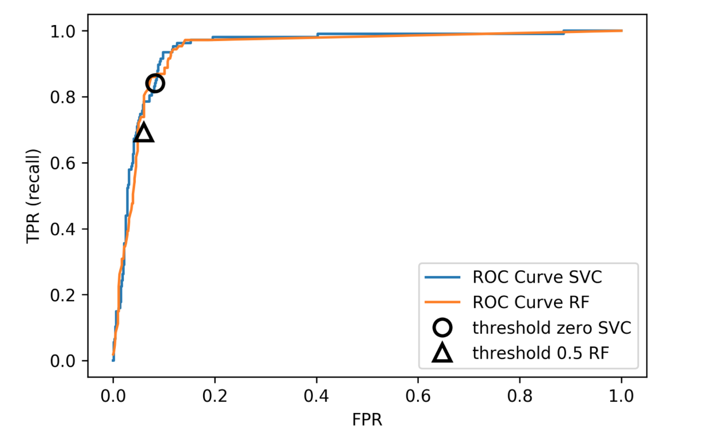

# Recap on W2 Supervised Learning Metrics

## Limitation of accuracy (*Accuracy paradox*)

- **Scenario: Data with 90% negatives** (imbalanced data)
- A majority strategy that predicts all as negative gets 90% accuracy, but this is useless.
- Different models can have the same accuracy (0.9) but make very different types of errors.
  <!-- - y_pred_1: Predicts all negative (90 TN, 0 TP)
  - y_pred_2: Predicts some positives correctly but misses others
  - y_pred_3: A mix of errors -->

```{python}
#| echo: false
from sklearn.metrics import confusion_matrix, ConfusionMatrixDisplay
from matplotlib.colors import Normalize
import matplotlib.pyplot as plt
import numpy as np


y_true = np.zeros(100, dtype=int)
y_true[:10] = 1
y_pred_1 = np.zeros(100, dtype=int)
y_pred_2 = y_true.copy()
y_pred_2[10:20] = 1
y_pred_3 = y_true.copy()
y_pred_3[5:15] = 1 - y_pred_3[5:15]

labels = ['1: predicts all negatives', '2: predicts positives correctly but missed others', '3: mix of errors']

fig, axes = plt.subplots(1, 3)
for i, (ax, y_pred) in enumerate(zip(axes, [y_pred_1, y_pred_2, y_pred_3])):
    ConfusionMatrixDisplay(confusion_matrix(y_true, y_pred), display_labels=['N', 'P']).plot(ax=ax, cmap='gray_r')
    ax.set_title("{}".format(labels[i]))
    ax.images[-1].colorbar.remove()
    ax.images[0].set_norm(Normalize(vmin=0, vmax=100))
plt.tight_layout()
# plt.savefig("images/problems_with_accuracy.png")
```

## Precision, Recall, and their trade-off

- **Precision**: $\frac{TP}{TP+FP}$. *Among predicted positives, how many are actually positive.*
- **Recall** (Sensitivity): $\frac{TP}{TP+FN}$. *Among actual positives, how many are correctly predicted.*

## Picking a metric

* Real-world problems are rarely balanced.
* Accuracy is rarely what you want.
* Find the right criterion; decide between emphasis on recall or precision.
* Identify which classes are important.

## Metric for breast cancer detection

* "1": malignant/cancer; "0": benign/no cancer.
* Missing a cancer (FN) is much worse than a false alarm (FP)
* So, we care more about **recall** than precision or accuracy.
* A model with high recall is preferred, even if it has lower precision.

## Imbalanced data is common
- Classification often has asymmetric costs or data imbalance
- Need metrics and models that respect imbalance

# This week

## Objectives
- Understand the sources of imbalanced data
- Learn methods to handle imbalanced data

## Two Sources of Imbalance
- Asymmetric cost between errors
- Asymmetric data prevalence

<!-- ## Why Do We Care?
- Real-world costs rarely symmetric
- Data often heavily imbalanced; rare event detection common -->

## Methods
- Adjust evaluation metrics (*What do you want to optimise?*)
- Change decision thresholds
- Change class-weights
- Ressampling data

## Adjust evaluation metrics

- Accuracy paradox for imbalanced data
- Use precision or recall
- If a method does not optimise your metric directly, use the metric in cross-validation

## Changing Thresholds
```{notes}
Don't think this example is good. Change it
```

- Adjust probability threshold to trade precision/recall
```python
y_pred = lr.predict_proba(X_test)[:, 1] > 0.85
classification_report(y_test, y_pred)
```
- Choose threshold to minimise given cost; can tune threshold using cross-validation

## ROC Curve
<div style="text-align:center;">
  
</div>
- Evaluates all thresholds via TPR vs FPR

## Remedies for the Model
- Beyond thresholding: modify data or training to address imbalance

## Mammography Data
:::: columns
::: {.column width="50%"}
```python
data = fetch_openml("mammography", as_frame=True)
X, y = data.data, data.target
X_train, X_test, y_train, y_test = train_test_split(
    X, y == "1", random_state=0)
```
:::
::: {.column width="50%"}
<div style="text-align:center;">
  
</div>
:::
::::
- Imbalanced dataset: 260 positive of 11183 samples

## Mammography Baselines
- LogisticRegression CV=10: ROC AUC 0.920, AP 0.630
- RandomForest CV=10: ROC AUC 0.939, AP 0.722

## Basic Approaches
:::: columns
::: {.column width="50%"}
<div style="text-align:center;">
  
</div>
:::
::: {.column width="50%"}
- Change the training procedure
- Modify data via sampling
:::
::::

## Scikit-learn vs Resampling
<div style="text-align:center;">
  
</div>
- Standard pipelines transform X only; cannot resample y without extensions

## Imbalance-Learn
- Library: http://imbalanced-learn.org
- `pip install -U imbalanced-learn`
- Extends sklearn API with samplers and pipelines

## Sampler API
- `data_resampled, targets_resampled = sampler.sample(X, y)`
- `fit_sample` convenience to fit and sample
- In pipelines, sampling only occurs during `fit`
- Many samplers are binary-only; check multiclass support

## Random Undersampling
- Drop majority samples until balanced
- Very fast; dataset shrinks to ~2x minority
- Loses data but can still perform well
```python
rus = RandomUnderSampler(replacement=False)
X_sub, y_sub = rus.fit_sample(X_train, y_train)
```

## Random Undersampling Results
- LogisticRegression: ROC AUC 0.927, AP 0.527 (baseline 0.920, 0.630)
- RandomForest: ROC AUC 0.951, AP 0.629 (baseline 0.939, 0.722)
- Often as accurate with fraction of data; great for large datasets

## Random Oversampling
- Repeat minority samples until balanced
- Dataset grows; slower training
```python
ros = RandomOverSampler()
X_over, y_over = ros.fit_sample(X_train, y_train)
```

## Random Oversampling Results
- LogisticRegression: ROC AUC 0.917, AP 0.585
- RandomForest: ROC AUC 0.926, AP 0.715
- Performance similar to baseline; heavier compute

## Curves for LogReg
<div style="text-align:center;">
  
</div>

## Curves for Random Forest
<div style="text-align:center;">
  
</div>

## Class-Weights
- Reweight loss instead of resampling
- Same effect as oversampling without data duplication
- Supported by most models

## Class-Weights in Linear Models
- Modify loss with per-class weight $c_{y_i}$
- Equivalent to repeating samples by class weight count

## Class-Weights in Trees
- Apply class weights in impurity (Gini or entropy)
- Use weighted votes for prediction

## Using Class-Weights
- LogisticRegression(class_weight="balanced"): ROC AUC 0.918, AP 0.587
- RandomForest(class_weight="balanced"): ROC AUC 0.917, AP 0.701

# Resampling

## Ensemble Resampling
- Random resampling separately per estimator in ensemble
- Example: Balanced bagging or balanced random forest
- Easy with imblearn; not yet in sklearn core

## Easy Ensemble with imblearn
:::: columns
::: {.column width="50%"}
```python
from imblearn.ensemble import BalancedBaggingClassifier
base = DecisionTreeClassifier(max_features="auto")
resampled_rf = BalancedBaggingClassifier(base_estimator=base, random_state=0)
```
:::
::: {.column width="50%"}
- Trains each tree on a different undersampled dataset
- ROC AUC 0.957, AP 0.654 (baseline RF 0.939, 0.722)
:::
::::
- As cheap as undersampling; strong results

## ROC vs PR Comparison
<div style="text-align:center;">
  
</div>
- Easy ensemble performs well at higher recall and precision regions

## Synthetic Sample Generation
- SMOTE: Synthetic Minority Oversampling Technique
- Interview-friendly method; many variants exist

## SMOTE
- Add synthetic points for minority class
- For each minority sample: pick random neighbor, interpolate on line segment
- Leads to larger datasets; can combine with undersampling

## SMOTE Illustration
<div style="text-align:center;">
  
</div>

## SMOTE Results
- LogisticRegression with SMOTE: ROC AUC 0.919, AP 0.585
- RandomForest with SMOTE: ROC AUC 0.946, AP 0.688
- Similar to baseline; tune k_neighbors for best AP

## SMOTE Tuning
<div style="text-align:center;">
  
</div>
- GridSearch over `smote__k_neighbors`; moderate impact on metrics

## SMOTE Curves
<div style="text-align:center;">
  
</div>

## ROC vs PR with SMOTE
<div style="text-align:center;">
  
</div>

## Summary
- Inspect both ROC AUC and average precision; review curves
- Undersampling is fast and can help
- Undersampling plus ensembles is powerful
- SMOTE adds synthetic samples; results vary by metric
