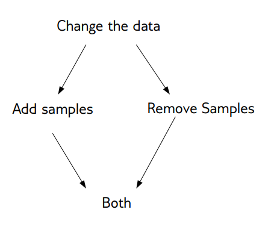
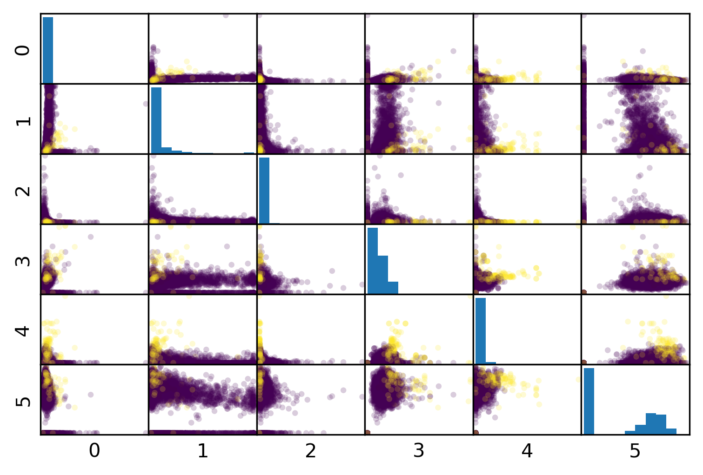
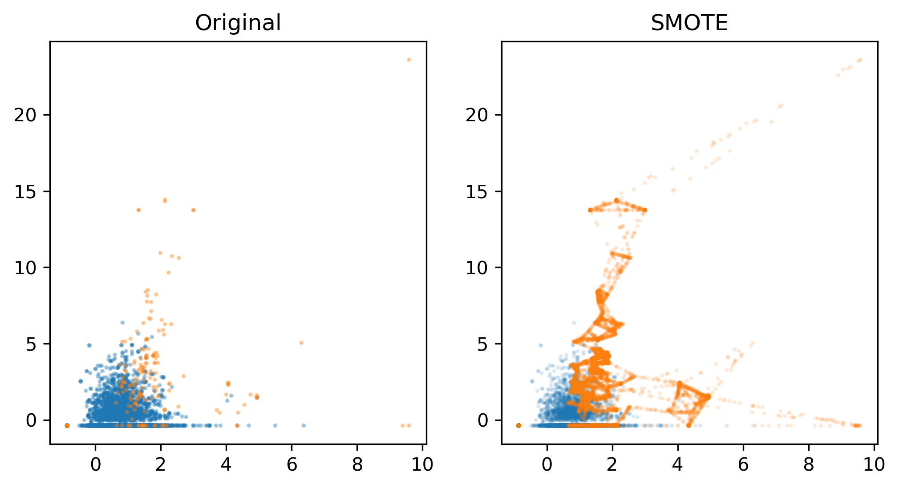
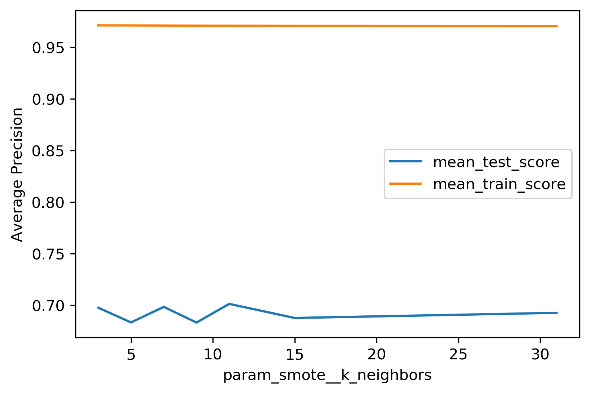
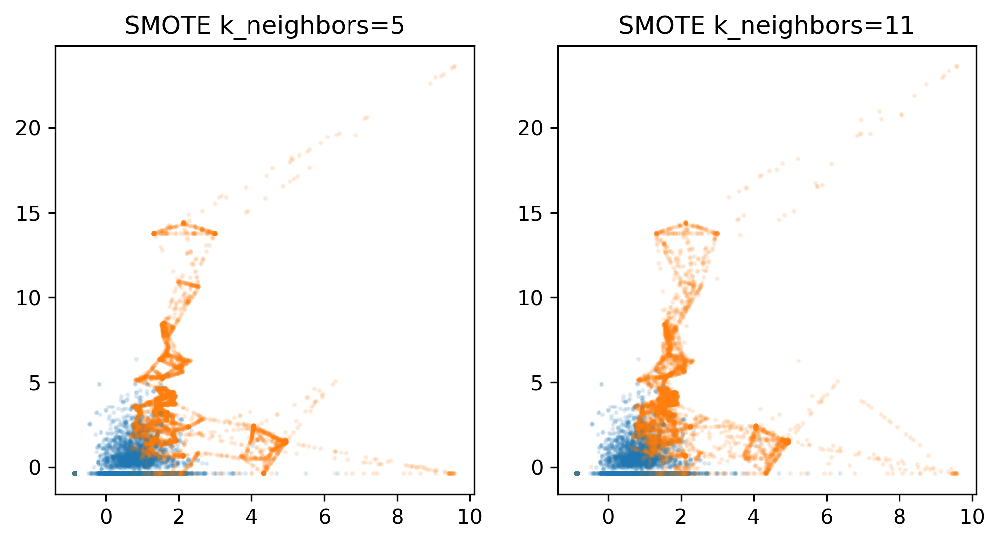
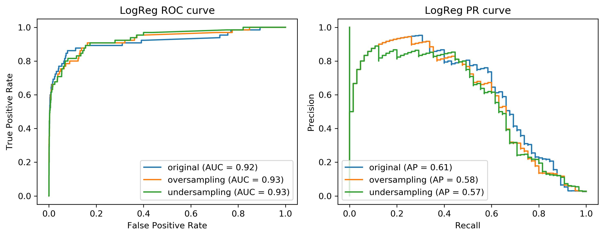
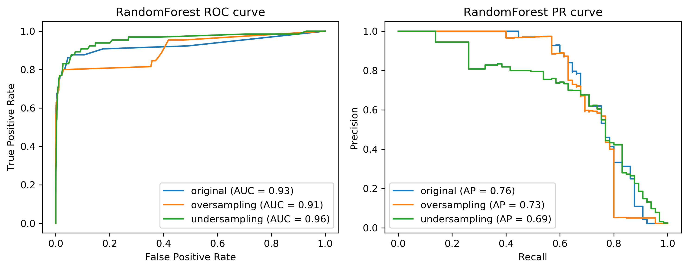
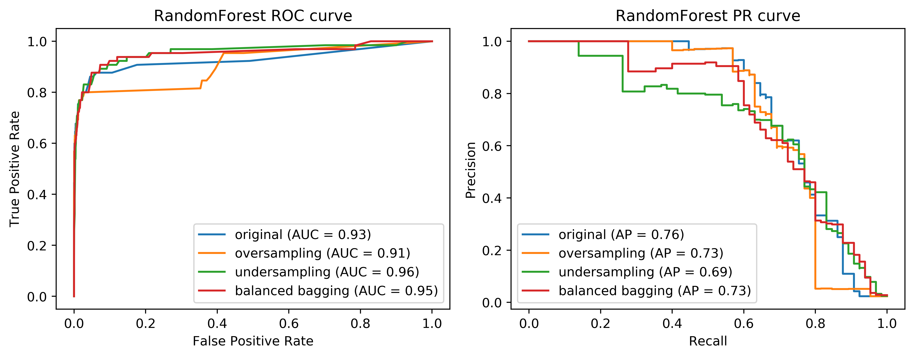
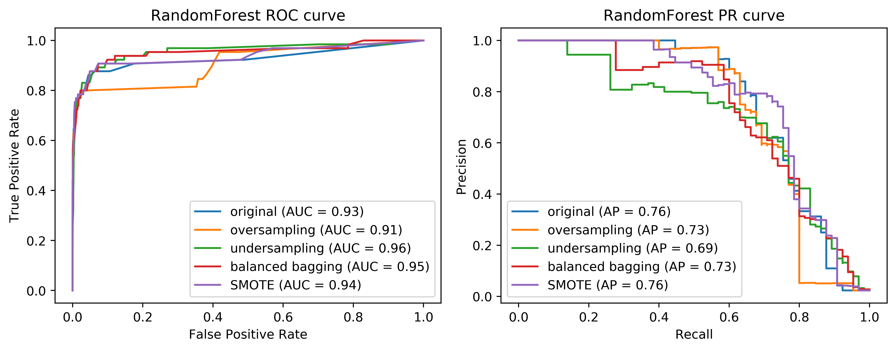

# Recap on W2 Supervised Learning Metrics

## Limitation of accuracy (*Accuracy paradox*)

- **Scenario: Data with 90% negatives** (imbalanced data)
- A majority strategy that predicts all as negative gets 90% accuracy, but this is useless.
- Different models can have the same accuracy (0.9) but make very different types of errors.
  <!-- - y_pred_1: Predicts all negative (90 TN, 0 TP)
  - y_pred_2: Predicts some positives correctly but misses others
  - y_pred_3: A mix of errors -->

```{python}
#| echo: false
from sklearn.metrics import confusion_matrix, ConfusionMatrixDisplay
from matplotlib.colors import Normalize
import matplotlib.pyplot as plt
import numpy as np


y_true = np.zeros(100, dtype=int)
y_true[:10] = 1
y_pred_1 = np.zeros(100, dtype=int)
y_pred_2 = y_true.copy()
y_pred_2[10:20] = 1
y_pred_3 = y_true.copy()
y_pred_3[5:15] = 1 - y_pred_3[5:15]

labels = ['1: predicts all negatives', '2: predicts positives correctly but missed others', '3: mix of errors']

fig, axes = plt.subplots(1, 3)
for i, (ax, y_pred) in enumerate(zip(axes, [y_pred_1, y_pred_2, y_pred_3])):
    ConfusionMatrixDisplay(confusion_matrix(y_true, y_pred), display_labels=['N', 'P']).plot(ax=ax, cmap='gray_r')
    ax.set_title("{}".format(labels[i]))
    ax.images[-1].colorbar.remove()
    ax.images[0].set_norm(Normalize(vmin=0, vmax=100))
plt.tight_layout()
# plt.savefig("images/problems_with_accuracy.png")
```

## Precision, Recall, and their trade-off

- **Precision**: $\frac{TP}{TP+FP}$. *Among predicted positives, how many are actually positive.*
- **Recall** (Sensitivity): $\frac{TP}{TP+FN}$. *Among actual positives, how many are correctly predicted.*

## Picking a metric

* Real-world problems are rarely balanced.
* Accuracy is rarely what we want.
* Find the right criterion; decide between emphasis on recall or precision.
* Identify which classes are important.

## Metric for breast cancer detection

* "1": malignant/cancer (37.3%)
* "0": benign/no cancer (62.7%)
* Missing a cancer (FN) is much worse than a false alarm (FP)
* So, we care more about **recall** than precision or accuracy.
* A model with high recall is preferred, even if it has lower precision.

## Imbalanced data is common
- Classification often has asymmetric costs or data imbalance
- Need metrics and models that respect imbalance

# This week

## Objectives
- Understand the sources of imbalanced data
- Learn methods for handling imbalanced data

## Two Sources of Imbalance
- Asymmetric data prevalence 
- Asymmetric cost between errors
  - Example: In medical diagnosis, missing a disease (FN) is much worse than a false alarm (FP)
  - Even if class prevalence is balanced, the cost of errors is not symmetric

<!-- ## Why Do We Care?
- Real-world costs rarely symmetric
- Data often heavily imbalanced; rare event detection common -->

## Methods for selecting imbalanced data
- Adjust evaluation metrics (*What do you want to optimise?*)
- Adjust decision thresholds
- Change class-weights
- Resample data

## Adjust evaluation metrics

- Accuracy paradox: accuracy is misleadingfor imbalanced data
- Use precision or recall

## Adjust thresholds

- Most models output probabilities (01). Default threshold *T* is 0.5
- If p(class=1) > *T*, predict Class 1; else predict 0
- Tuning *T* shifts the balance between precision and recall

## Precision-Recall Curve with varying thresholds

```{python}
#| echo: false
from sklearn.datasets import load_breast_cancer
from sklearn.ensemble import RandomForestClassifier
from sklearn.metrics import precision_recall_curve
from sklearn.model_selection import train_test_split
import matplotlib.pyplot as plt
import numpy as np

# Load data: 1 = malignant, 0 = benign
data = load_breast_cancer(as_frame=True)
X = data.data
y = (data.target == 0).astype(int)

# Train/test split
X_train, X_test, y_train, y_test = train_test_split(
    X, y, test_size=0.2, random_state=42, stratify=y
)

# Train Random Forest
rf = RandomForestClassifier(n_estimators=100, random_state=42)
rf.fit(X_train, y_train)

# Get probability predictions
y_proba = rf.predict_proba(X_test)[:, 1]

# Compute precision-recall curve
precision, recall, thresholds = precision_recall_curve(y_test, y_proba)

# Plot
plt.figure(figsize=(10, 6))
plt.plot(recall, precision, linewidth=2, label='Precision-Recall Curve')

# Mark specific thresholds
threshs_to_mark = [0.2, 0.5, 0.8]
colors = ['red', 'green', 'blue']
for thresh, color in zip(threshs_to_mark, colors):
    # Find closest threshold index
    idx = np.argmin(np.abs(thresholds - thresh))
    plt.plot(recall[idx], precision[idx], 'o', markersize=10, color=color, 
             label=f'Threshold={thresh}')

plt.xlabel('Recall', fontsize=12)
plt.ylabel('Precision', fontsize=12)
plt.title('Precision-Recall Curve (Breast Cancer, Malignant=1)', fontsize=14)
plt.legend(fontsize=10)
plt.grid(alpha=0.3)
plt.xlim([0, 1])
plt.ylim([0, 1])
plt.tight_layout()
plt.show()
```

## Tuning Threshold with Cross-Validation

```{python}
#| echo: true
from sklearn.datasets import load_breast_cancer
from sklearn.ensemble import RandomForestClassifier
from sklearn.metrics import recall_score
from sklearn.model_selection import cross_validate, StratifiedKFold
import numpy as np

# Load data: 1 = malignant, 0 = benign
data = load_breast_cancer(as_frame=True)
X = data.data
y = (data.target == 0).astype(int)

# Cross-validation with threshold tuning
cv = StratifiedKFold(n_splits=5, shuffle=True, random_state=42)
thresholds = np.arange(0.1, 1.0, 0.1)
recall_scores = {thresh: [] for thresh in thresholds}

for train_idx, val_idx in cv.split(X, y):
    X_train, X_val = X.iloc[train_idx], X.iloc[val_idx]
    y_train, y_val = y.iloc[train_idx], y.iloc[val_idx]
    
    # Train Random Forest
    rf = RandomForestClassifier(n_estimators=100, random_state=42)
    rf.fit(X_train, y_train)
    
    # Get probability predictions on validation fold
    y_proba = rf.predict_proba(X_val)[:, 1]
    
    # Evaluate recall at different thresholds
    for thresh in thresholds:
        y_pred = (y_proba >= thresh).astype(int)
        recall = recall_score(y_val, y_pred, pos_label=1, zero_division=0)
        recall_scores[thresh].append(recall)

# Average recall across folds for each threshold
mean_recalls = {thresh: np.mean(scores) for thresh, scores in recall_scores.items()}

# Find optimal threshold
optimal_thresh = max(mean_recalls, key=mean_recalls.get)
print(f"Thresholds tested: {thresholds.min():.1f} to {thresholds.max():.1f}, step length = 0.1")
print(f"Optimal threshold: {optimal_thresh:.1f} (Recall = {mean_recalls[optimal_thresh]:.4f})")
```

## Change class-weights

- Many classifcation algorithms use a weighted loss function in model training.
- $$L = \frac{1}{n} \sum_{i=1}^{n} c_{y_i} \cdot \ell(y_i, \hat{y}_i)$$
- Weight indicates importance. The weight can be set for a class or individually for each sample. 
- If weight for a class is set higher, model training will penalise misclassifying that class more heavily.
- Can use cross-validation to tune class weights

## Class-Weights in tree-based methods

```{python}
#| echo: false
from sklearn.datasets import load_breast_cancer
from sklearn.ensemble import RandomForestClassifier
from sklearn.metrics import recall_score
from sklearn.model_selection import train_test_split
import matplotlib.pyplot as plt

# Load data: malignant = 1, benign = 0
data = load_breast_cancer(as_frame=True)
X = data.data
y = (data.target == 0).astype(int)

# Train/test split
X_train, X_test, y_train, y_test = train_test_split(
  X, y, test_size=0.2, random_state=42, stratify=y
)

# Try different class weights for malignant class (class 1)
weights_for_class1 = [1, 2, 3, 4, 5, 6, 7, 8, 9, 10]
recalls = []

for w in weights_for_class1:
  rf = RandomForestClassifier(
    n_estimators=200,
    random_state=42,
    class_weight={0: 1, 1: w}
  )
  rf.fit(X_train, y_train)
  y_pred = rf.predict(X_test)
  recalls.append(recall_score(y_test, y_pred, pos_label=1))

# print("Recall by class weight (malignant = class 1):")
# for w, r in zip(weights_for_class1, recalls):
#   print(f"class_weight{{0:1, 1:{w}}} -> recall: {r:.4f}")

# Line plot: class weight vs recall
plt.figure(figsize=(8, 4))
plt.plot(weights_for_class1, recalls, marker='o', linewidth=2)
plt.xlabel('Class weight for malignant (class 1)')
plt.ylabel('Recall (class 1)')
plt.title('Effect of class weights on recall (Breast Cancer, Random Forest)')
plt.grid(alpha=0.3)
plt.tight_layout()
plt.show()
```

<!-- ## Using Class-Weights
- LogisticRegression(class_weight="balanced"): ROC AUC 0.918, AP 0.587
- RandomForest(class_weight="balanced"): ROC AUC 0.917, AP 0.701 -->

## Resample data

- Resampling modifies the training data to balance classes. 
- **Random undersampling**: drop majority samples until balanced
- **Random oversampling**: repeat minority samples until balanced
- **SMOTE**: create synthetic minority samples by interpolating between existing ones
- **Ensemble resampling**: train multiple models on different balanced subsets and aggregate predictions

## Basic Approaches
:::: columns
::: {.column width="50%"}
<div style="text-align:center;">
  
</div>
:::
::: {.column width="50%"}
- Change the training procedure
- Modify data via sampling
:::
::::

## Mammography Data

- Wisconsin Diagnostic Breast Cancer (WDBC) dataset from OpenML
- Imbalanced dataset: 260 positive of 11183 samples

:::: columns
::: {.column width="50%"}
```python
data = fetch_openml("mammography", as_frame=True)
X, y = data.data, data.target
X_train, X_test, y_train, y_test = train_test_split(
    X, y == "1", random_state=0)
```
:::
::: {.column width="50%"}
<div style="text-align:center;">
  
</div>
:::
::::

## Random Undersampling

- Drop majority samples until balanced
- Very fast; dataset shrinks to ~2x minority
- Problem: can lose majority samples; unstable for small datasets

```{python}
#| echo: true
from sklearn.datasets import load_breast_cancer
from sklearn.ensemble import RandomForestClassifier
from sklearn.metrics import recall_score, classification_report
from sklearn.model_selection import train_test_split
from imblearn.pipeline import Pipeline
from imblearn.under_sampling import RandomUnderSampler

# Load data: malignant = 1, benign = 0
data = load_breast_cancer(as_frame=True)
X = data.data
y = (data.target == 0).astype(int)

# Train/test split
X_train, X_test, y_train, y_test = train_test_split(
    X, y, test_size=0.2, random_state=42, stratify=y
)

# Pipeline: RandomUnderSampler → RandomForestClassifier
pipe = Pipeline([
    ('sampler', RandomUnderSampler(random_state=42)),
    ('clf', RandomForestClassifier(n_estimators=100, random_state=42))
])

# Fit only on training data; sampler is NOT applied at predict time
pipe.fit(X_train, y_train)
y_pred = pipe.predict(X_test)

print(f"Recall (malignant=1): {recall_score(y_test, y_pred, pos_label=1):.4f}")
print(classification_report(y_test, y_pred, target_names=['Benign', 'Malignant']))
```

<!-- ## Random Undersampling Results
- LogisticRegression: ROC AUC 0.927, AP 0.527 (baseline 0.920, 0.630)
- RandomForest: ROC AUC 0.951, AP 0.629 (baseline 0.939, 0.722)
- Often as accurate with fraction of data;  -->

## Random Oversampling
- Repeat minority samples until balanced
- Dataset grows; slower training
```python
ros = RandomOverSampler()
X_over, y_over = ros.fit_sample(X_train, y_train)
```

## Synthetic Sample Generation
- SMOTE: Synthetic Minority Oversampling Technique
- Add synthetic points for minority class
- For each minority sample: pick random *k* neighbors, interpolate on line segment
- Leads to larger datasets

## SMOTE Illustration
<div style="text-align:center;">
  
</div>

<!-- ## SMOTE Tuning
<div style="text-align:center;">
  
</div>
- GridSearch over `smote__k_neighbors`; moderate impact on metrics

## SMOTE Curves
<div style="text-align:center;">
  
</div> -->


<!-- ## Random Oversampling Results
- LogisticRegression: ROC AUC 0.917, AP 0.585
- RandomForest: ROC AUC 0.926, AP 0.715
- Performance similar to baseline; heavier compute -->

## Curves for LogReg
<div style="text-align:center;">
  
</div>

## Curves for Random Forest
<div style="text-align:center;">
  
</div>

## Resampling in practice: when should we apply resampling?

- Resampling should be applied after train-test split, and only on the training data
- Resampling is only applied to training data, not test data
- Test data should reflect real-world distribution; resampling test data would give an unrealistic evaluation of model performance

## Scikit-learn not support resampling

- Sklearn doesn't support resampling in its API; sklearn's pipelines transform X only and cannot resample y
- Need to do it manually or use imbalaned-learn extension

<div style="text-align:center;">
  
</div>

## Imbalance-Learn
- Library: http://imbalanced-learn.org
- To install: `pip install -U imbalanced-learn`
- Extends sklearn API with samplers and pipelines

## sklearn pipelines (no resampling)

```{python}
#| echo: true
#| eval: false
# train/test split
X_train, X_test, y_train, y_test = train_test_split(
    X, y, test_size=0.2, random_state=42, stratify=y
)

# sklearn Pipeline: imputation → normalisation → classifier (no resampling)
sklearn_pipeline = Pipeline([
    ('imputer', SimpleImputer(strategy='median')),
    ('scaler', StandardScaler()),
    ('clf', RandomForestClassifier(n_estimators=100, random_state=42))
])

sklearn_pipeline.fit(X_train, y_train)
y_pred = sklearn_pipeline.predict(X_test)
print(f"Recall (malignant=1): {recall_score(y_test, y_pred, pos_label=1):.4f}")
```

## sklearn pipelines with resampling

- Sampler only runs during fit, NOT at prediction
- This is achieved by `from imblearn.pipeline import Pipeline` 

```{python}
#| echo: true
#| eval: false

from imblearn.pipeline import Pipeline as ImbPipeline
from imblearn.under_sampling import RandomUnderSampler

# imblearn Pipeline: imputation → normalisation → undersampling → classifier
imb_pipeline = ImbPipeline([
    ('imputer', SimpleImputer(strategy='median')),
    ('scaler', StandardScaler()),
    ('sampler', RandomUnderSampler(random_state=42)),
    ('clf', RandomForestClassifier(n_estimators=100, random_state=42))
])

# Sampler only runs during fit, NOT at prediction time
imb_pipeline.fit(X_train, y_train)
y_pred = imb_pipeline.predict(X_test)
print(f"Recall (malignant=1): {recall_score(y_test, y_pred, pos_label=1):.4f}")
```

## Ensemble resampling
- Random resampling separately per estimator in ensemble
- Example: Balanced bagging or balanced random forest
- Easy with imblearn `BalancedBaggingClassifier` (sklearn API compatible)

## Easy Ensemble with imblearn

- Bag of Boosted Learners; by default using AdaBoostClassifier as base estimator
- Trains each tree on a different under-sampled dataset
- As cheap as undersampling, but much more powerful than undersampling alone, as it prevents overfitting

```python
from imblearn.ensemble import EasyEnsembleClassifier

ee = EasyEnsembleClassifier(n_estimators=10, random_state=42)
ee.fit(X_train, y_train)

y_pred = ee.predict(X_test)
```

<!-- ## ROC vs PR Comparison
<div style="text-align:center;">
  
</div>
- Easy ensemble performs well at higher recall and precision regions -->

<!-- ## ROC vs PR with SMOTE
<div style="text-align:center;">
  
</div> -->

## Summary
- Inspect both ROC AUC and average precision; review curves
- Undersampling is fast and can help
- Undersampling plus ensembles is powerful
- SMOTE adds synthetic samples; results vary by metric
